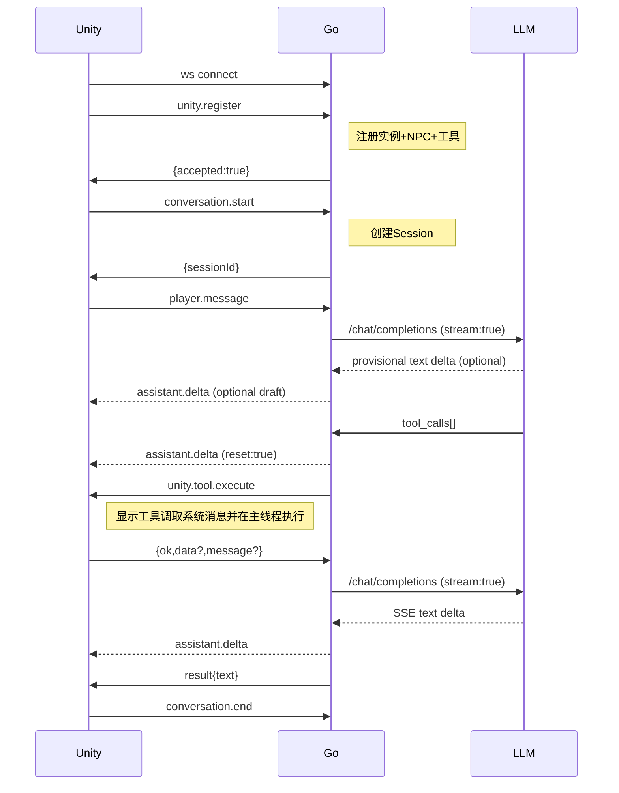

# NPC Agent 系统架构说明

## 总体架构

系统采用 Unity + Go 的双进程架构，核心原则是“Go 决策，Unity 执行”。

Go Agent Host 负责大模型调用、对话 Session、工具决策、参数校验和请求追踪；Unity 负责玩家交互、NPC 实体状态以及实际游戏行为。两端通过 `/unity/ws` 上的 WebSocket JSON-RPC 2.0 协议通信。

## Go Agent Host

Go 是智能决策和会话状态的权威来源，主要包含：

- `agent`：维护对话 Session，调用 LLM，并运行 tool-call 循环。
- `tools`：根据 Unity 注册的能力生成模型可见工具，完成参数和策略校验。
- `unity`：维护 Unity 实例、NPC 和工具能力快照，并将工具命令路由到正确连接。
- `handler`：提供 `/unity/ws`、`/health` 和根路径 HTTP 入口。

Go 不直接操作 Unity 对象，也不保存游戏世界的实时权威状态。运行时 Session 仍使用内存存储；Go 重启后内存为空，仅在 Unity 显式加载存档时从 Go 自有 JSON 快照恢复对应 NPC 上下文。

## Unity 执行端

Unity 是游戏世界和行为结果的权威来源，主要包含：

- `AgentHostClient`：连接对话 UI 与 Go Agent Host。
- `UnityGatewayClient`：负责 WebSocket 连接、注册、重连和协议收发。
- `NpcTool<TArgs>`：单个工具的扩展点，在独立类中声明名称、描述、可用性和执行适配。
- `ToolContract<TArgs>`：从 C# 参数类型和 `[ToolParameter]` 生成、缓存 Schema，并按同一契约严格反序列化。
- `NpcToolDiscovery`：启动时通过 `[NpcTool]` 反射发现工具类；具体工具使用 `[Preserve]` 防止 IL2CPP 裁剪。
- `ToolsRegistry`：保存已发现工具的运行时目录，同时提供 Gateway 工具目录、每 NPC 可用工具名和按名称执行。
- `CommandDispatcher`：把网络命令投递到目标 NPC 的主线程队列，不包含具体工具分支。
- `NpcEntity`：调用 NavMesh 等 Unity API 执行行为，并返回稳定的工具结果。
- `InventoryComponent`：物品容器的权威状态和原子转移逻辑；`containerId` 必须显式配置且唯一。
- `InventoryViewModel`：维护运行时容器登记、玩家背包引用和当前 `ItemDataList` 静态物品表。
- `SaveGameService`：在 `Application.persistentDataPath/SaveGames` 原子保存/加载 Unity 世界状态；存档保存玩家/NPC 变换和稳定 `containerId` 对应的物品栏格子。

Unity 不直接调用 LLM，不保存 LLM API Key，也不维护模型使用的完整对话历史；加载成功后只缓存 Go 投影返回的 user/最终 assistant 可见消息。

### Unity 工具扩展模型

工具使用“独立工具类 + 反射发现”的扩展模型：

1. 参数类型继承 `ToolArgsBase`，公共字段或属性自动成为 Schema 属性；`[ToolParameter]` 声明必填、范围、长度、枚举、数组元素和描述等约束。
2. 工具类继承 `NpcTool<TArgs>`，并使用 `[NpcTool]` 标记。
3. `NpcTool<TArgs>` 通过 `ToolContract<TArgs>` 自动提供 JSON Schema；具体工具只提供名称、描述、`IsAvailable` 和领域行为适配。
4. `NpcToolDiscovery` 在 `ToolsRegistry` 初始化时扫描并注册工具；扫描和注册只发生在主线程初始化阶段。
5. Schema 在首次访问参数类型时生成并缓存；不支持的成员类型、错误约束、循环类型或重复 JSON 字段会让工具注册失败。
6. Go 按 Unity 注册的 Schema 校验一次；Unity 收到调用后再次拒绝未知字段、错误类型、缺失必填项、越界值和不合法数组，再反序列化成 `TArgs`。
7. `Validate` 仅补充空白字符串、跨字段关系或游戏语义等结构 Schema 无法完整表达的规则。
8. `NpcEntity` 从自己的主线程队列取出命令后，通过 `ToolsRegistry` 执行。失败结果使用 `{ok:false,errorCode,message}`；成功结果使用 `{ok:true,data?,message?}`，其中结构化数据必须放在 `data`，不得二次编码到字符串。

反射发现的工具必须拥有公共无参构造函数，并标记 Unity `Preserve`，避免 IL2CPP 构建裁剪。工具能力仍然以 Unity 运行时注册为唯一来源，Go 不保存重复 Schema。

### 每 NPC 动态工具能力

Unity 的能力快照包含全局工具目录 `tools`、在线 NPC 列表 `npcs` 和 `npcTools` 映射。`IsAvailable` 根据当前 NPC 的真实组件状态判断能力，例如：

- 移动工具要求启用且处于激活对象上的 `NavMeshAgent`。
- 物品栏工具要求启用的 `InventoryComponent`。

`NpcEntity` 在主线程检测可用工具集合变化并触发完整能力快照。NPC 上下线时先同步路由，再同步与在线 NPC 精确对应的 `npcTools`；注册响应期间发生的变化也会在注册完成后对账。Unity 的能力通知串行发送，Go 原子替换快照，并在模型暴露和执行前都按实例、NPC、工具三元组校验。

### NPC 物品栏工具

当前 Unity 运行时声明六个物品栏工具：

| 工具 | 行为 |
|---|---|
| `game_inventory_get_item_definitions` | 返回当前 `ItemDataList` 中定义的全部物品种类 |
| `game_inventory_get_self` | 返回当前对话 NPC 自身背包中的全部物品和数量 |
| `game_inventory_get_nearby_containers` | 返回已注册容器的稳定标识、距离、所属目标和交互范围 |
| `game_inventory_get_container` | 返回指定近距离容器中的全部物品和数量 |
| `game_inventory_put_item` | 将 NPC 自身背包中的指定物品原子转移到近距离容器 |
| `game_inventory_take_item` | 从近距离容器原子取出指定物品放入 NPC 背包 |

容器查询只接受显式配置的稳定 `InventoryComponent.ContainerId`，匹配忽略大小写，但不接受 GameObject 名称或显示名称作为别名。缺失和重复标识分别返回 `CONTAINER_ID_MISSING`、`CONTAINER_ID_AMBIGUOUS`。玩家的容器 ID 会随 `PLAYER_ID` 同步为 `player:<playerId>.inventory`。远程容器查询和转移返回 `CONTAINER_TOO_FAR` 及结构化距离数据，最大交互距离由目标 NPC 的 `inventoryInteractionRange` 配置，默认值为 3。

物品转移先完整检查源持有数量和目标容量，不允许部分转移；异常失败会恢复源物品。静态物品数据由场景 `PlayerMock.itemDataList` 在启动时发布到运行时物品栏注册表，不从 Go 或 LLM 构造。工具层拒绝缺失或重复的 `itemId`。

### 场景移动目标工具

`game_npc_move` 是长时工具：Unity 设置 NavMesh 目的地后保持请求 pending，只有 NPC 实际到达停止距离内才返回成功。路径无效、路径不完整、NPC 离开 NavMesh、NPC 销毁或收到 `unity.tool.cancel` 时结束当前移动；取消请求不再回传迟到的工具结果。

Unity 运行时声明只读工具 `game_npc_get_state`，返回当前对话 NPC 的状态、世界坐标、NavMesh 状态，以及当前移动目标、路径状态和剩余距离。所有字段均在 Unity 主线程按调用时的真实状态生成，Go 不缓存或推断 NPC 状态。

Unity 运行时声明 `game_scene_get_targets`，从当前激活的 `NpcEntity`、`PlayerMock` 和 `NpcLandmark` 发现目标。稳定标识分别为 `npc:<npcId>`、`player:<playerId>` 和 `landmark:<landmarkId>`，场景中必须唯一。查询结果包含 `targetId`、显示名称、类别、直线距离、NavMesh 可达性、路径距离和是否为动态目标。
`game_npc_move` 按 `targetId` 解析目标并在附近采样 NavMesh；NPC 和玩家移动时会定时重新规划路径。Unity 组件和实时场景状态是目标权威来源，Go 不维护重复目标清单。

## 核心交互链路

1. Unity 连接 Go，并注册实例、NPC 和工具能力。
2. 玩家在 Unity 中与 NPC 交互，Unity 向 Go 创建对话并提交消息。
3. Go 调用 LLM；如果模型直接回复，结果返回 Unity 展示。
   - 每次调用前，Go 按 `LLM_MAX_CONTEXT_CHARS` 对会话历史做字符预算裁剪。`system` 消息始终保留；从最近一轮向前保留完整轮次，assistant tool call 与对应 tool result 不会被拆开。
   - Go 对 429、5xx 和尚未向 UI 输出文本时的网络失败最多重试 `LLM_MAX_RETRIES` 次，并遵循有上限的 `Retry-After`；一旦文本已对玩家可见就不自动重试，避免重复输出。
4. 如果模型请求工具，Go 校验参数和权限后向 Unity 下发 `unity.tool.execute`。
5. Unity 在主线程执行 NPC 行为并返回结果。
6. Go 将工具结果写回模型上下文，再生成最终回复返回 Unity。

## 数据所有权

- 对话、模型请求和工具决策：Go 权威。
- NPC、GameObject、NavMesh 和行为结果：Unity 权威。
- 实际可执行工具 Schema：Unity 提供，Go 按会话和 NPC 筛选。
- UI 消息列表：Unity 只保存展示缓存，不作为模型历史。
- 世界存档：Unity 权威；对话快照：Go 权威。两端文件只用 Unity 生成的 canonical UUID `saveId` 一一关联。

系统只使用当前内部协议版本 `protocolVersion: 2`，不包含 v1 兼容层，也不实现标准 MCP 外部接口。

---

## 协议层详细分析（ARCHITECTURE.md + 代码对照）

### 一、JSON-RPC 2.0 信封

所有消息均使用 JSON-RPC 2.0 信封，结构为：

```json
{
  "jsonrpc": "2.0",
  "method": "...",     // 请求/通知
  "id": "...",         // 请求/响应对应
  "params": {...},     // 请求参数
  "result": {...},     // 成功响应
  "error": {           // 错误响应
    "code": -32601,
    "message": "..."
  }
}
```

### 二、协议方法常量（12个）

| 方法名 | 方向 | 请求/通知 | 含义 |
|---|---|---|---|
| `unity.register` | Unity→Go | 请求（需id） | Unity实例注册，提交instanceId、工具目录、NPC列表和npcTools映射 |
| `unity.npc.changed` | Unity→Go | 通知（id可选） | NPC上下线变更 |
| `unity.tools.changed` | Unity→Go | 通知（id可选） | 工具能力动态变更 |
| `unity.tool.execute` | Go→Unity | 请求（需id） | Go要求Unity执行指定工具 |
| `unity.tool.cancel` | Go→Unity | 通知（无id） | Go要求取消正在执行的工具 |
| `conversation.start` | Unity→Go | 请求（需id） | 玩家发起新对话 |
| `player.message` | Unity→Go | 请求（需id） | 玩家发送消息文本 |
| `conversation.end` | Unity→Go | 通知（id可选） | 结束对话 |
| `savegame.conversations.save` | Unity→Go | 请求（需id） | 按 `saveId` 保存当前玩家在本实例中的全部 NPC 上下文 |
| `savegame.conversations.load` | Unity→Go | 请求（需id） | 校验 Go JSON 快照后整体替换内存上下文并返回新 Session 映射 |
| `assistant.status` | Go→Unity | 通知（无id） | 保留的助手非文本状态通知；聊天窗口不展示 thinking |
| `assistant.delta` | Go→Unity | 通知（无id） | Go推送模型文本增量；`reset:true` 撤回当前未完成草稿 |

### 三、Unity 端 DTO

**文件**: `Assets/Scripts/Networking/UnityGatewayProtocol.cs`

| DTO | 字段 | 说明 |
|---|---|---|
| `UnityGatewayProtocol` | `Version = 2` | 静态协议常量类，含12个方法字符串 |
| `UnityGatewayToolDefinition` | `Name`, `Description`, `InputSchema(JObject)` | 单个工具定义 |
| `UnityGatewayCapabilitySnapshot` | `Tools`, `Npcs`, `NpcTools` | Unity 主线程生成的完整能力快照 |
| `UnityGatewayRegistration` | `ProtocolVersion`, `InstanceId`, `Tools`, `Npcs`, `NpcTools` | 注册时提交的完整能力快照 |
| `UnityGatewayToolExecuteParams` | `NpcId`, `Tool`, `Arguments(JObject)` | 工具执行参数（arguments是JSON对象，非字符串） |
| `UnityGatewayToolCancelParams` | `RequestId` | 取消工具执行 |
| `UnityGatewayToolResult` | `Ok`, `ErrorCode`(nullable), `Message`(nullable), `Data(JToken)`(nullable) | 工具执行结果（业务层） |
| `UnityGatewayConversationStartResult` | `SessionId`, `NpcId` | 对话创建结果 |
| `UnityGatewayAssistantReply` | `Type`, `SessionId`, `NpcId`, `Text` | 助手文本回复 |
| `UnityGatewayAssistantStatus` | `Type`, `SessionId`, `Status` | 助手状态推送 |
| `UnityGatewayAssistantDelta` | `Type`, `SessionId`, `Text`, `Reset` | 助手文本增量推送；Reset撤回当前草稿 |
| `UnityGatewayConversationSaveResult` | `Ok`, `ErrorCode`, `SaveId`, `OperationId`, `ContextCount`, `SavedAt` | 对话快照保存结果 |
| `UnityGatewayConversationLoadResult` | `Ok`, `ErrorCode`, `SaveId`, `Contexts`, `LoadedAt` | 恢复后的 NPC→新 Session 映射和可见历史 |

**文件**: `Assets/Scripts/Models/Models.cs`

| DTO | 字段 | 说明 |
|---|---|---|
| `UnityToolCommand` | `NpcId`, `RequestId`, `Function` | 工具命令落地结构体 |
| `UnityToolFunction` | `Name`, `ArgumentsJson` | 工具函数名+参数JSON字符串 |

### 四、Go 端 DTO（协议层 + 内部模型）

**文件**: `internal/unity/protocol.go`

| 类型 | 字段 | 说明 |
|---|---|---|
| `jsonRPCMessage` | `JSONRPC`, `Method`, `ID`, `Params`, `Result`, `Error` | JSON-RPC 信封 |
| `jsonRPCError` | `Code`, `Message` | 错误体 |
| `ToolDefinition` | `Name`, `Description`, `InputSchema` | 工具定义 |
| `UnityRegistration` | `ProtocolVersion`, `InstanceID`, `Tools`, `NPCs`, `NPCTools` | 注册参数及完整能力一致性校验 |
| `UnityRegistrationResult` | `Accepted`, `ProtocolVersion` | 注册响应 |
| `UnityNPCChangedParams` | `InstanceID`, `NPCID`, `Online` | NPC变更 |
| `UnityToolsChangedParams` | `InstanceID`, `Tools`, `NPCTools` | 工具目录和每 NPC 能力完整快照 |
| `ConversationStartParams` | `PlayerID`, `NPCID` | 对话开始 |
| `ConversationStartResult` | `SessionID`, `NPCID` | 对话开始结果 |
| `PlayerMessageParams` | `Type`, `SessionID`, `Text` | 玩家消息 |
| `ConversationEndParams` | `SessionID` | 对话结束 |
| `SavegameConversationSaveParams` | `ProtocolVersion`, `InstanceID`, `PlayerID`, `SaveID`, `OperationID`, `Mode` | 对话快照保存请求 |
| `SavegameConversationLoadParams` | `ProtocolVersion`, `InstanceID`, `PlayerID`, `SaveID`, `NPCIDs` | 对话快照加载请求 |
| `AssistantStatusParams` | `Type`, `SessionID`, `Status` | 状态推送 |
| `AssistantDeltaParams` | `Type`, `SessionID`, `Text`, `Reset` | 文本增量推送；Reset撤回当前草稿 |
| `UnityToolExecuteParams` | `NPCID`, `Tool`, `Arguments` | 工具执行+Validate()检查是JSON对象 |
| `UnityToolCancelParams` | `RequestID` | 取消 |
| `ToolResult` | `OK`, `ErrorCode`, `Message`, `Data` | 工具结果；Data保持原生JSON结构 |

**文件**: `internal/agent/session.go`

| 类型 | 字段 | 说明 |
|---|---|---|
| `Session` | `ID`, `PlayerID`, `NPCID`, `UnityInstanceID`, `SystemPrompt`, `Messages`, `Model`, `CurrentToolCallID`, `CreatedAt`, `LastActiveAt` | 对话会话 |

**文件**: `internal/agent/session_store.go`

| 类型 | 说明 |
|---|---|
| `SessionStore` 接口 | `Load`, `Save`, `Delete`, `ListByOwner`, `ReplaceByOwner` |
| `MemorySessionStore` | 运行时内存实现；加载时按 `playerId+instanceId` 原子替换 |
| `FileConversationArchive` | Go 自有 JSON 快照；临时文件提交，不在启动时扫描 |

### 五、Go Session Handler（消息路由核心）

**文件**: `internal/unity/session.go`

`jsonRPCSession` 结构：
- `conn` - WebSocket连接接口
- `registry` - Unity注册表
- `conversations` - 对话服务
- `conversationIDs` - 本连接拥有的对话ID集合
- `pending` - 内部请求pending map（key: requestId, value: channel）
- `writeMu` - 发送锁

`readLoop()` 消息路由：
- `method == ""` → `complete()` 响应匹配
- `unity.register` → `handleUnityRegister()` 注册并验证
- `unity.npc.changed` → `handleUnityNPCChanged()` 更新NPC
- `unity.tools.changed` → `handleUnityToolsChanged()` 更新工具
- `conversation.start` → `handleConversationStart()` 创建Session
- `player.message` → `handlePlayerMessage()` (goroutine) 处理消息 → LLM调用 → 返回回复
- `conversation.end` → `handleConversationEnd()` 结束对话
- `savegame.conversations.save` → 校验连接所有权并异步保存一致快照
- `savegame.conversations.load` → 完整校验后整体替换 Session，并重建本连接 `conversationIDs`
- 默认 → JSON-RPC error -32601

关键辅助方法：
- `executeUnityTool()` - 向Unity发送tool.execute请求，通过pending channel等待响应，带超时取消
- `sendUnityToolCancel()` - 取消工具执行
- `complete()` - 匹配pending请求的响应
- `writeNotification()` / `writeResult()` / `writeError()` - 写消息

### 六、Go UnityRegistry

- `Register()` - 注册Unity实例（替换旧会话，更新NPC路由和工具）
- `UnregisterSession()` - 断线清理
- `UpdateNPC()` - NPC上下线
- `UpdateTools()` - 原子替换工具目录和每 NPC 工具映射
- `ResolveNPC()` - NPC → instanceID + session
- `CapabilitiesForNPC()` - 获取某NPC可用的工具
- `HasTool()` - 按实例、NPC、工具三元组检查

### 七、Go ToolExecutor

- `Execute()` - 解析NPC→session，校验工具可用性，带timeout调用session.executeUnityTool()

### 八、Go ConversationService

- `StartSession()` - 创建Session，生成system prompt，存储
- `SubmitMessageStream()` - 追加user消息，进入tool loop：SSE LLM调用 → 推送文本增量 → 判断tool calls → 调用Runtime.Execute → 追加tool结果 → 循环
- `EndSession()` - 取消进行中的操作，删除Session
- `SaveConversations()` - 非阻塞取得所有目标 Session 锁，保存无 system/sessionId 的一致快照；相同 operationId 幂等
- `LoadConversations()` - 先校验文件、playerId 和 NPC 集合，再以当前 system prompt/model 生成新 Session 并原子替换

### 九、Go Tool Loop 流程

1. 从Runtime获取NPC可用工具Schema
2. 将消息+工具发给LLM
3. 如果LLM直接回复 → 返回AssistantReply
4. 如果LLM请求工具 → Policy.Authorize校验 → Runtime.Execute → 结果追加到消息历史 → 继续循环
5. 超过MaxToolRounds → 返回错误

### 十、Unity 客户端消息处理流程

**UnityGatewayClient**:
- `ReceiveLoopAsync()` → `HandleMessageAsync()`
- 有method → 分发到ToolCallReceived/ToolCancellationReceived/AssistantStatusReceived/AssistantDeltaReceived事件
- 无method → `HandleResponseAsync()` → 匹配pending或registration响应

**AgentHostClient**:
- 门面层，管理会话生命周期
- `PrepareConversationAsync()` → `EnsureSessionAsync()` → `StartConversationAsync()`
- `SubmitPlayerInputAsync()` → `SendPlayerMessageAsync()` → UI回调
- `SendToolResponseAsync()` → `SendToolResultAsync()`

### 十一、完整交互时序



### 十二、错误码体系

| 错误码 | 含义 |
|---|---|
| -32600 | Invalid Request（缺少id） |
| -32601 | Method not found |
| -32602 | Invalid params |
| -32001 | 业务错误（NPC/Tools更新） |
| -32004 | NPC未注册 |
| -32010 | Agent Host未配置 |
| -32011 | 对话不属于当前连接 |
| -32012 | 对话会话不存在或已失效 |
| -32020 | 未分类的对话处理失败 |
| -32021 | LLM 永久请求错误，不应自动重试 |
| -32022 | LLM 临时请求错误，可稍后重试 |

业务层错误通过 `{ok:false, errorCode:"...", message:"..."}` 返回，不走JSON-RPC error。

Unity 仅在收到 `-32011` 或 `-32012` 时丢弃本地会话映射，并尽力发送 `conversation.end`；LLM 临时或永久错误不会清空 Session，避免丢失已有上下文。

## 游戏存档与对话快照

- Unity 初次进入默认场景只注册运行时能力，不自动请求历史。
- 按 `G` 打开存档界面。新建和覆盖都先原子提交 Unity 世界 JSON，再调用 `savegame.conversations.save`；失败时世界文件保留 `conversationSynced:false` 和原 `operationId`，可显式重试。
- 加载时先等待当前玩家消息结束并结束旧 Session，再在 Unity 主线程应用世界状态，随后调用 `savegame.conversations.load`。成功后整体替换 NPC→Session 映射和聊天 UI 缓存；失败时不混用旧对话，聊天保持禁用直到重试加载成功。
- Unity 世界文件和 Go 对话文件互不读取，只以同一个 canonical lowercase UUID `saveId` 关联。覆盖沿用 saveId；operationId 标识一次保存动作。
- Go 快照目录由 `CONVERSATION_SAVE_DIR` 配置，默认是仓库内 `GameMCPServer/data/conversations`。该目录不提交版本控制。
- 业务失败使用 `SAVE_ALREADY_EXISTS`、`SAVE_NOT_FOUND`、`PLAYER_MISMATCH`、`NPC_SET_MISMATCH`、`CONVERSATION_BUSY`、`SNAPSHOT_INVALID`、`STORAGE_IO_ERROR`；非法字段或 UUID 仍返回 JSON-RPC `-32602`。
