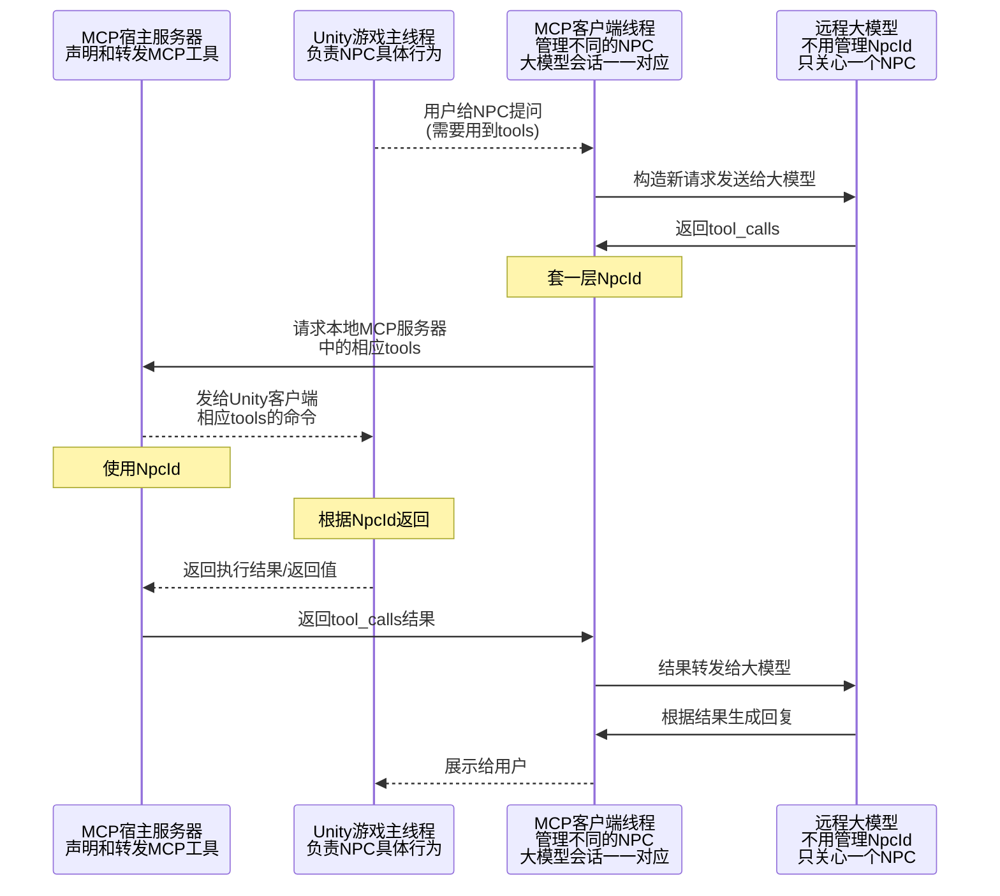

```mermaid
sequenceDiagram
    participant MCPHost as MCP宿主服务器<br/>声明和转发MCP工具
    participant UnityMain as Unity游戏主线程<br/>负责NPC具体行为
    participant MCPClient as MCP客户端线程<br/>管理不同的NPC<br/>大模型会话一一对应
    participant LLM as 远程大模型<br/>不用管理NpcId<br/>只关心一个NPC

    UnityMain-->>MCPClient: 用户给NPC提问<br/>(需要用到tools)
    MCPClient->>LLM: 构造新请求发送给大模型
    LLM->>MCPClient: 返回tool_calls
    Note over MCPClient: 套一层NpcId
    MCPClient->>MCPHost: 请求本地MCP服务器<br/>中的相应tools
    MCPHost-->>UnityMain: 发给Unity客户端<br/>相应tools的命令
    Note over MCPHost: 使用NpcId
    Note over UnityMain: 根据NpcId返回
    UnityMain-->>MCPHost: 返回执行结果/返回值
    MCPHost->>MCPClient: 返回tool_calls结果
    MCPClient->>LLM: 结果转发给大模型
    LLM->>MCPClient: 根据结果生成回复
    MCPClient-->>UnityMain: 展示给用户
```