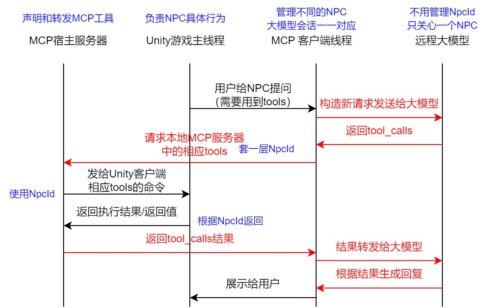

为了让你在后续进入实际代码编写时有据可依，我们将 **MCP（Model Context Protocol，模型上下文协议）客户端与本地宿主服务器之间** 的通信协议与标准进行一次全景总结

> **历史设计稿：** 本文描述的是重构前或可选标准 MCP 蓝图，不代表当前已实现接口。当前运行架构是 Go Agent Host + Unity 内部协议 v1，唯一 WebSocket 入口为 `/unity/ws`；请以仓库根目录 `README.md` 和 `docs/Unity与Go大模型能力边界重构计划.md` 的“迁移收尾结果”为准。

---

## 一、 通信基础标准：核心三要素

MCP 协议在设计之初就确立了极简、高效、与语言无关的原则。在游戏进程（MCP Client）与独立宿主进程（MCP Server）之间，通信严格基于以下三大标准：

1. **协议规范：JSON-RPC 2.0**
两端的所有对话必须遵循标准的 JSON-RPC 2.0 文本规范。每条消息必须声明 `jsonrpc: "2.0"`，请求必须带上唯一的 `id`，应答必须原路携带该 `id` 回传。
2. **物理载体（单机游戏场景）：进程间通信 (IPC)**
在单机游戏环境下，为了保证性能并规避网络波动，官方原生推荐使用 **Stdio（标准输入输出流管道）** 或本地 **WebSocket / TCP Socket（监听 `127.0.0.1`）**。两端共享单条长连接，通过多路复用（Multiplexing）技术让所有 NPC 的数据流在同一条通道上奔跑。
3. **架构边界：只管“红色”，不管“黑色”**
* **红色线（MCP标准）：** 宿主服务与大模型、宿主服务与游戏客户端的通信，必须使用标准的 MCP JSON 字段。
* **黑色线（私有逻辑）：** 游戏内部如何把命令投递给具体 NPC 的状态机（FSM）并执行，属于游戏引擎层面的私有逻辑，MCP 协议完全解耦、概不干涉。



---

## 二、 核心通信生命周期模型 (Lifecycle Models)

在实际运行中，MCP 协议规定了两端交互必须经历的三个标准阶段，每个阶段都有严格的数据模型（Schema）规范：

### 阶段 1：初始化握手 (Capabilities Negotiation)

当游戏启动、网络通道建立后，双方首先确认彼此支持的协议版本和能力。

* **Client 请求方法：** `initialize`
* **关键字段：** `protocolVersion`（协议版本）、`capabilities`（能力声明）。
* **标准规定：** 此时游戏端向宿主声明“我这里有可供调用的工具箱”，但**不发送**具体的工具列表。

### 阶段 2：动态工具发现 (Tools Discovery)

大模型在思考前，宿主服务需要向游戏端拉取当前可用的具体游戏技能列表。

* **宿主请求方法：** `tools/list`
* **返回数据模型：** `tools` 顶级数组。
* **标准规定：** 游戏端必须使用 **JSON Schema** 规范来详细描述每个工具的参数。为了**隐藏 `NpcId**` 并防止大模型混乱，工具的 `inputSchema` 中只暴露业务参数（如 `targetLandmark`），严禁暴露任何实体 ID。

### 阶段 3：工具调用与原子闭环 (Tool Execution Loop)

大模型决定采取行动时触发的核心闭环

* **宿主请求方法：** `tools/call`
* **网络层数据模型（McpToolCallRequest）：**
在网络通道中，为了支持单通道复用，宿主服务器会利用**闭包会话机制**，自动将隐藏的 `NpcId` 当作顶级标签与大模型生成的参数重新拼装，发给 Unity：
```json
{
  "jsonrpc": "2.0",
  "method": "tools/call",
  "id": "由宿主生成的事务ID",
  "params": {
    "npc_id": "Ryan_001", // ◄── 通道路由标签，对大模型隐蔽
    "name": "game_npc_move",
    "arguments": "{\"targetLandmark\":\"warehouse\"}" // ◄── 干净的大模型参数
  }
}

```


* **游戏端返回模型（McpToolCallResponse）：**
Unity 主线程的状态机（FSM）异步消纳完动作后，通过包装中间件（Middleware）集中捕获成功或崩溃日志，原路返回：
```json
{
  "jsonrpc": "2.0",
  "id": "对应的事务ID",
  "result": {
    "content": [ { "type": "text", "text": "[Unity 反馈]: 动作执行成功" } ],
    "isError": false // ◄── 显式标记状态，大模型据此感知逻辑成败
  }
}
```


---

## 三、 面向独立游戏开发的工程落地死律 (Engineering Rules)

为了确保这套协议标准在 Unity 中运行时不会导致游戏掉帧、内存暴涨（GC）或状态死锁，在工程落地时需严守以下三条铁律：

1. **原子性隔离（Atomic Isolation）：**
大模型发出的 `tool_calls` 与游戏端返回的 `tool response` 在上下文记忆中是**不可分割的原子对**。在 Unity MCP 客户端管理对话历史并进行“滑动窗口裁剪”时，绝对不能将某一对工具的请求与回复切散，否则会导致大模型逻辑直接崩溃。
2. **主线程防御性拦截（Defensive Middleware）：**
大模型由于天然的幻觉，可能会输入各种格式错误的脏 JSON 或不合规的数据。游戏端在路由字典（`Dictionary<string, IMcpTool>`）前，必须加一层泛型包装拦截器（`McpToolWrapper<T>`），在**非主线程**提前完成 JSON 解析与参数合法性校验（`Validate`），将风险 100% 隔离在游戏核心逻辑之外。
3. **分布式异步消纳（Asynchronous Consuming）：**
由于全局只有一个 MCP 客户端网络线程，它收到网络包裹后，**不解析、不占帧**，只根据 `NpcId` 标签，像快递员一样把包裹塞入具体 NPC 挂载的私有线程安全队列（`ConcurrentQueue`）中。具体的 NPC 实体在游戏主循环的 `Update` 中，根据自身的 FSM 状态（如：死亡、眩晕、战斗中）自主决定在主线程消费动作，完美规避多线程死锁。

---

## 总结

MCP 协议标准的核心魅力在于 **“规范了混乱，解耦了未来”**。它在模糊的 AI 自然语言与严谨的游戏数字世界之间划出了一条清爽的红黑边界。遵守这套标准，你的游戏主线程将永远处于轻量、安全、高效的状态，而你的 NPC 则真正拥有了分布式、可扩展、能听懂指令并操作场景的独立灵魂。