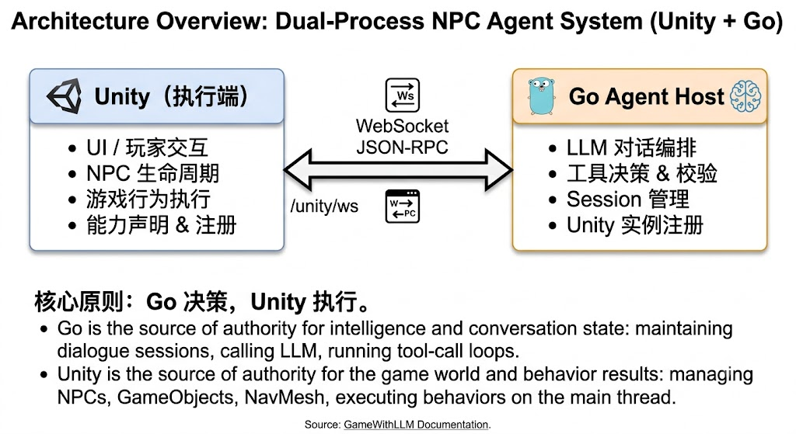

# NPC Agent 系统

基于 Unity + Go 的双进程 NPC Agent 系统：玩家在 Unity 中发起对话，Go Agent Host 调用大模型并决定是否执行工具，Unity 在主线程执行真实游戏行为并返回结果。

NPC 工具重构的实现结果与验证记录见 [TOOL_OPTIMIZATION_PROGRESS.md](./TOOL_OPTIMIZATION_PROGRESS.md)。

## 项目简介

在传统游戏开发中，NPC 的对话与行为逻辑通常依赖于固定预设的脚本或行为树，缺乏应对复杂语境与玩家自由输入的灵活性与沉浸感。本项目旨在将大语言模型（LLM）深度接入游戏环境，打破固有的交互范式。

为避免 LLM 仅停留在“文本对话机器人”层面，本项目引入了类似于 **MCP (Model Context Protocol)** 的 `tool_call` 机制，赋予大模型在游戏内可调用的工具能力，从而真正架起大模型与游戏世界实体交互的桥梁。同时，本项目将这套交互流程进行了标准化与工程化封装，为游戏开发者提供了一套高扩展性、开箱即用的解决方案。

## 视频介绍
https://www.bilibili.com/video/BV1cqgv6wEHc/?share_source=copy_web&vd_source=247cd1a718f5f2f1d2c6ea557a563c1e

## 核心功能

* **动态沉浸式对话**：打破固定对话树限制，通过大模型赋予 NPC 上下文感知与灵活自然的回应能力，大幅提升游戏内容的丰富度与玩家沉浸感。
* **类 MCP 工具调用（Tool Call）**：NPC 不仅能“说话”，更能“行动”。大模型能够自主判断并触发 Unity 中的工具函数（如移动到指定地点、检查背包、放入/取出物品等），实现从决策到真实游戏行为的落地。
* **双进程解耦架构**：采用 Go 服务端集中处理会话状态、LLM 轮询与决策逻辑，Unity 客户端专注于主线程游戏世界表现与物理/行为执行，保证安全与高性能。
* **高度标准化与工程化**：基于规范的 JSON-RPC 2.0 通信协议，支持 Unity 运行时**动态注册与反射发现**工具，无需在 Go 侧硬编码 Schema，为开发者扩展新工具提供便利。

## 架构概览

**核心原则：Go 决策，Unity 执行。**



* **Go** 是智能决策和会话状态的权威来源：维护对话 Session、调用 LLM、运行 tool-call 循环
* **Unity** 是游戏世界和行为结果的权威来源：管理 NPC、GameObject、NavMesh，在主线程执行行为

详细架构说明见 [ARCHITECTURE.md](https://www.google.com/search?q=./ARCHITECTURE.md)。

## 项目结构

| 目录 | 职责 |
| --- | --- |
| `GameMCPServer/` | Go Agent Host：LLM、Session、工具策略、参数校验、Unity 注册与命令调度 |
| `unity-NPC-agent-client/` | Unity 执行端：UI、NPC 生命周期、运行时能力声明、主线程游戏行为 |

## 环境要求

为方便新手快速搭建与运行，请在开始前确保已安装以下依赖及工具：

* **Go** >= 1.26：[Go 官方下载页面](https://www.google.com/search?q=https://go.dev/dl/)（请根据操作系统下载对应的安装包并配置环境变量）
* **Unity** 6000.3.x（编辑器推荐版本 `6000.3.19f1`）：可通过 [Unity Hub 官网](https://www.google.com/search?q=https://unity.com/download) 进行管理安装，或在 [Unity 归档页面](https://www.google.com/search?q=https://unity.com/releases/editor/archive) 获取对应版本
* **Node.js**（用于运行协议测试脚本）：[Node.js 官方下载页面](https://www.google.com/search?q=https://nodejs.org/)（推荐下载 LTS 长期支持版本）

## 快速开始

### 1. 克隆并配置环境变量

```bash
git clone https://github.com/ytzuo/GameWithLLM.git
cd GameWithLLM

```

从模板创建 `.env.local` 并填入配置：

```bash
cp .env.example .env.local
```

编辑 `.env.local`，必须配置的项：

```env
LLM_API_URL=https://api.openai.com/v1/chat/completions
LLM_API_KEY=sk-your-key-here
LLM_MODEL=gpt-4o-mini
```

> `.env.example` 中列出了所有可用配置项及其默认值。`.env.local` 不会被提交到 Git。

### 2. 启动 Go Agent Host

```bash
# 方式一：使用 Makefile
make server

# 方式二：直接运行
cd GameMCPServer
go run ./cmd/server
```

服务默认监听 `:8080`，提供：

* `/unity/ws` — Unity WebSocket 入口
* `/health` — 健康检查

### 3. 打开 Unity 项目

1. 使用 Unity Hub 打开 `unity-NPC-agent-client` 目录
2. 打开 `SampleScene` 场景
3. 点击 Play 运行

Unity 会自动连接 Go Agent Host 并完成注册。之后在场景中与 NPC 对话即可体验。

### 4. 验证系统正常

对话中可尝试：

* 普通闲聊 — 模型直接回复文本
* `场景里有哪些可去的位置` — 触发 `game_scene_get_targets`，查询 NPC、玩家和地标的稳定 `targetId`、距离与 NavMesh 可达性
* `让 NPC 移动到仓库` — 模型先查询 `landmark:warehouse`，再触发 `game_npc_move` 沿 NavMesh 移动
* `你现在在哪里、正在做什么` — 触发 `game_npc_get_state`，查询 NPC 的实时位置和移动状态
* `你背包里有什么` — 触发 `game_inventory_get_self`
* `查看附近 Alice_001 的背包` — 在交互距离内触发 `game_inventory_get_container`
* `把 1 个 Rock 放进附近的 Alice_001` — 触发 `game_inventory_put_item`
* `从附近容器取出 1 个 Wood` — 触发 `game_inventory_take_item`

## 配置参考

### Go Agent Host

| 变量 | 说明 | 默认值 |
| --- | --- | --- |
| `AGENT_HOST_ADDR` | HTTP 监听地址 | `:8080` |
| `AGENT_HOST_BASE_URL` | 对外访问 URL | `[http://127.0.0.1:8080](http://127.0.0.1:8080)` |
| `UNITY_JSONRPC_WS_URL` | Unity WS 连接地址 | `ws://127.0.0.1:8080/unity/ws` |
| `UNITY_TOOL_TIMEOUT_SECONDS` | 工具执行超时（秒） | `10` |
| `LLM_API_URL` | LLM API 端点 | `[https://api.openai.com/v1/chat/completions](https://api.openai.com/v1/chat/completions)` |
| `LLM_API_KEY` | LLM API 密钥 | — |
| `LLM_MODEL` | 模型名称 | `gpt-4o-mini` |
| `LLM_REQUEST_TIMEOUT_SECONDS` | LLM 请求超时（秒） | `60` |
| `LLM_MAX_RETRIES` | 429、5xx 或安全网络失败的最大重试次数；已向 UI 输出文本后不重试 | `2` |
| `LLM_MAX_TOOL_ROUNDS` | 单轮对话最大工具调用次数 | `4` |
| `LLM_MAX_CONTEXT_CHARS` | 单个会话发送给模型的上下文字符预算；按完整对话轮次裁剪 | `32000` |

### Unity

| 变量 | 说明 | 默认值 |
| --- | --- | --- |
| `UNITY_JSONRPC_WS_URL` | Go Agent Host WebSocket 地址 | `ws://127.0.0.1:8080/unity/ws` |
| `UNITY_INSTANCE_ID` | Unity 实例标识 | `local-game-1` |
| `PLAYER_ID` | 玩家标识 | `local-player-1` |

配置优先级：**进程环境变量 > `.env.local` > `.env` > 默认值**。

## 开发

### Go 测试与检查

```bash
cd GameMCPServer
go test ./...
go vet ./...
go test -race ./...
```

### 协议测试

```bash
node GameMCPServer/test_mcp.js --start-server
```

### 给项目添加新工具

1. 创建继承 `ToolArgsBase` 的参数类型；用 `[ToolParameter]` 声明必填、范围、枚举、描述等结构约束
2. 在 `Validate` 中只保留空白字符串、跨字段关系或游戏语义等 JSON Schema 无法完整表达的校验
3. 创建带 `[NpcTool]` 和 `[Preserve]` 的 `NpcTool<TArgs>` 工具类，声明名称、描述、可用性和执行适配
4. `ToolContract<TArgs>` 会从 C# 类型生成并缓存 JSON Schema，执行时以同一契约严格反序列化
5. 工具在 Unity 启动时通过反射注册；Go 通过 `unity.register` 动态发现，并按 `npcTools` 只暴露给实际可用的 NPC

> **禁止**在 Go 侧硬编码重复的 Schema。工具能力的唯一来源是 Unity 运行时注册。

移动目标由激活的 `NpcEntity`、`PlayerMock` 和 `NpcLandmark` 组件动态提供。它们分别形成
`npc:<npcId>`、`player:<playerId>` 和 `landmark:<landmarkId>`，并要求 `targetId` 全局唯一。
`game_scene_get_targets` 返回 `targetId`、类别、距离、NavMesh 可达性和路径距离；
`game_npc_move` 在执行和动态追踪期间始终按该稳定标识重新解析真实目标。

## 关键约束

* LLM API Key、对话历史、tool loop 仅存在于 Go 进程
* Unity 不直接请求 LLM，不持有 API Key
* Go 不直接操作 Unity GameObject
* Unity API 调用必须在主线程执行
* 工具参数在网络协议中必须是 JSON 对象，不得二次编码为 JSON 字符串
* 当前会话存储为内存实现，Go 重启后对话不恢复

更多约束与规则见 [agents.md](./agents.md)。

## 协议

两端通过 WebSocket JSON-RPC 2.0 协议通信，唯一入口为 `/unity/ws`。当前协议版本为 `protocolVersion: 1`。

10 个协议方法：

| 方法 | 方向 | 说明 |
| --- | --- | --- |
| `unity.register` | Unity→Go | 注册实例、工具和能力 |
| `unity.npc.changed` | Unity→Go | NPC 上下线变更 |
| `unity.tools.changed` | Unity→Go | 工具能力动态变更 |
| `conversation.start` | Unity→Go | 发起新对话 |
| `player.message` | Unity→Go | 玩家消息 |
| `conversation.end` | Unity→Go | 结束对话 |
| `unity.tool.execute` | Go→Unity | 要求执行工具 |
| `unity.tool.cancel` | Go→Unity | 取消工具执行 |
| `assistant.status` | Go→Unity | 推送助手状态 |
| `assistant.delta` | Go→Unity | 推送模型生成的文本增量 |
