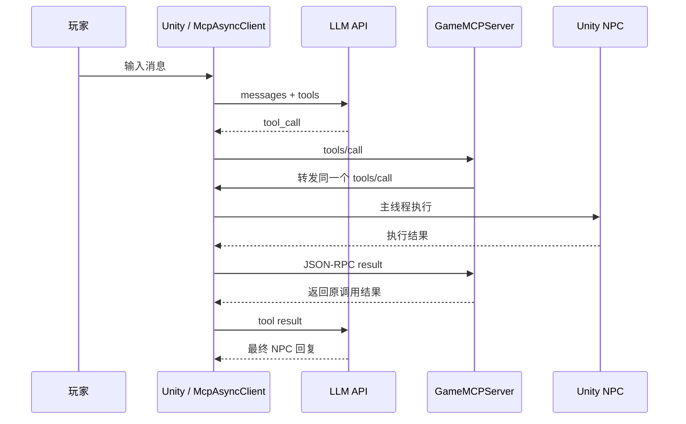
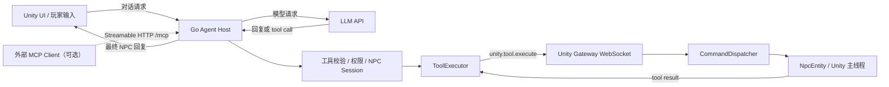

# GameMCPServer 改造与目标架构建议

## 1. 文档目的

本文基于仓库当前实现，明确 `GameMCPServer` 的实际角色、现存问题、目标架构和分阶段改造方案。

本次建议遵循以下原则：

- 保留 Go 服务有价值的会话、路由、安全和可观测性能力。
- 不再手写 WebSocket 底层协议。
- 不把 Go 与 Unity 之间的私有执行协议伪装成标准 MCP。
- 标准 MCP 接口与 Unity 内部网关分层实现。
- Unity API 仍只允许在 Unity 主线程调用。
- 先稳定现有单机链路，再按实际需求增加外部 MCP 能力。

***

## 2. 当前实现与实际链路

### 2.1 当前组件职责

当前 Unity 客户端同时承担：

- 读取 LLM 配置和 API Key。
- 调用 OpenAI Chat Completions。
- 保存当前 NPC 的对话上下文。
- 向模型声明工具。
- 接收模型返回的 `tool_calls`。
- 通过 WebSocket 把工具调用发送给 Go。
- 接收 Go 转发回来的工具命令。
- 将命令投递到 Unity 主线程中的 NPC。
- 等待执行结果并继续调用 LLM。

当前 Go 服务承担：

- 暴露 `/health`、`/ws` 和根路径。
- 手动完成 WebSocket 握手与帧读写。
- 解析一部分 JSON-RPC 2.0 消息。
- 返回硬编码的工具列表。
- 接收 Unity 发出的 `tools/call`。
- 将同一调用通过同一条连接转发回 Unity。
- 使用请求 ID 等待 Unity 的执行结果。
- 执行超时控制。

### 2.2 当前实际时序



这条链路中，Go 服务暂时没有掌握 LLM 会话，也没有执行游戏逻辑。它本质上是一个本地环回中转站。

***

## 3. 主要问题

### 3.1 Go 服务的角色没有形成有效边界

Unity 已经拥有模型调用、工具声明、工具路由和执行结果处理。Go 收到工具调用后又发回同一个 Unity 实例，没有提供明确的权限、安全或调度边界。

如果 LLM 会话继续完全留在 Unity，工具调用可以直接进入 `CommandDispatcher`，无需经过 Go 环回。

### 3.2 WebSocket 实现不应自行维护

`internal/unity/websocket.go` 当前只覆盖了最基本的握手和文本帧，尚未完整处理：

- 分片消息和 continuation frame。
- Ping/Pong 与连接保活。
- 标准关闭握手。
- 严格的客户端 Mask 校验。
- UTF-8 合法性检查。
- 读写 deadline。
- Origin 校验。
- 压缩扩展。
- 完整的协议错误关闭码。

这些属于成熟 WebSocket 库应当负责的基础能力，不属于项目业务逻辑。

### 3.3 当前协议不是标准 MCP

当前实现只有 `tools/list` 和 `tools/call` 的一部分字段，没有完整实现：

- `initialize` 生命周期。
- 协议版本协商。
- Client/Server capabilities。
- 标准 MCP Transport。
- 通知、取消和进度。
- 标准工具参数与结果语义。

此外，当前 `tools/call.params` 中加入了私有 `npcId`，并把 `arguments` 二次编码成 JSON 字符串。因此该协议应被定义为 Unity 内部执行协议，而不是标准 MCP Transport。

### 3.4 工具 Schema 存在双重来源

`game_npc_move` 的工具描述同时存在于：

- Go 的 `internal/unity/tools.go`。
- Unity 的 `ToolsRegistry` / `CommandDispatcher`。

新增工具或修改参数时容易发生漂移。Go 当前也没有依据 Schema 完整验证参数，只检查字段是否为空。

### 3.5 Unity 网络客户端职责过多

`McpAsyncClient.cs` 同时包含：

- WebSocket 连接。
- LLM HTTP 请求。
- 对话循环。
- 玩家输入等待。
- 工具调用 pending 管理。
- Unity 命令接收。
- dotenv 配置。

此外还存在以下网络风险：

- 使用固定 8192 字节缓冲区，但没有根据 `EndOfMessage` 拼接 WebSocket 分片。
- 多个异步发送操作没有统一串行化。
- pending 字典不是线程安全容器。
- 工具等待没有独立超时和取消。
- 连接断开时没有统一终止全部 pending 请求。
- WebSocket 消息后追加换行，但 WebSocket 本身已有消息边界。

***

## 4. 架构决策

### 4.1 短期决策

短期将 Go 服务明确为 **Unity Execution Gateway**：

- 负责维护 Unity 连接。
- 负责 Unity 实例和 NPC 的注册信息。
- 负责发送工具执行命令。
- 负责请求 ID、超时、取消和结果关联。
- 负责必要的权限校验和日志。
- 不自行实现 WebSocket 帧协议。
- 不把内部 WebSocket 通道声明为标准 MCP。

### 4.2 推荐决策

为了让 Go 服务真正形成安全和职责边界，推荐将 LLM 会话编排迁移到 Go：

- LLM API Key 不再进入游戏客户端。
- Go 管理每个玩家/NPC 的对话 Session。
- Go 调用 LLM 并处理 tool call 循环。
- Go 将经过校验的游戏命令发送给 Unity。
- Unity 只负责输入展示和游戏行为执行。

如果近期不准备迁移 LLM，则应允许 Unity 直接执行本地工具，暂时绕过 Go 环回链路。

***

## 5. 目标架构



### 5.1 Go 侧职责

Go 侧最终负责：

- HTTP 服务生命周期。
- Unity WebSocket 连接管理。
- Unity 实例、NPC 和工具目录注册。
- 对话 Session 与 NPC 上下文绑定。
- LLM 请求和工具调用闭环。
- 工具输入校验和权限判断。
- 请求超时、取消和错误映射。
- 日志、指标和追踪。
- 可选的标准 MCP 接口。

Go 侧不负责：

- 直接操作 Unity GameObject。
- 管理 NavMeshAgent。
- 执行 Unity 主线程 API。
- 手写 WebSocket 底层协议。

### 5.2 Unity 侧职责

Unity 侧最终负责：

- 玩家输入和聊天 UI。
- 注册当前 Unity 实例、在线 NPC 和工具能力。
- 接收经过 Go 校验的工具命令。
- 将网络命令投递到主线程队列。
- 在 NPC FSM 中判断当前动作是否可执行。
- 执行 NavMesh、动画和游戏对象操作。
- 返回明确的成功或失败结果。

***

## 6. 技术选型

### 6.1 HTTP Server

继续使用 Go 标准库 `net/http`。当前只有少量路由，不需要额外引入 Gin、Echo 等 Web 框架。

将 `http.ListenAndServe` 改为显式的 `http.Server`，至少配置：

- `ReadHeaderTimeout`。
- `IdleTimeout`。
- 日志。
- OS Signal 驱动的优雅关闭。

### 6.2 Unity WebSocket

使用：

```text
github.com/coder/websocket
```

该库负责 WebSocket 握手、帧、Ping/Pong、关闭、并发写和上下文取消。项目只处理完整的业务消息。

### 6.3 内部 JSON-RPC

短期可以继续保留 JSON-RPC 2.0 Envelope，但只把它当作内部 RPC 格式。

当前消息种类较少，建议先使用强类型 DTO 和一个轻量 dispatcher，不必立即引入完整 JSON-RPC 框架。方法数量明显增加或出现复杂双向调用后，再评估：

```text
github.com/creachadair/jrpc2
```

### 6.4 标准 MCP

未来标准 `/mcp` 接口使用：

```text
github.com/modelcontextprotocol/go-sdk/mcp
```

由官方 SDK 负责：

- MCP 生命周期。
- Streamable HTTP。
- 工具注册和调用。
- Schema 推断与校验。
- 标准错误和 Session。

MCP Handler 内部只调用项目的 `ToolExecutor`，不直接操作 WebSocket。

***

## 7. Unity 内部执行协议

### 7.1 连接注册

Unity 建立连接后应主动注册自身能力：

```json
{
  "jsonrpc": "2.0",
  "id": "register-1",
  "method": "unity.register",
  "params": {
    "protocolVersion": 1,
    "instanceId": "local-game-1",
    "tools": [
      {
        "name": "game_npc_move",
        "description": "使 NPC 前往指定地标",
        "inputSchema": {
          "type": "object",
          "properties": {
            "targetLandmark": {
              "type": "string",
              "enum": ["warehouse", "gate"]
            }
          },
          "required": ["targetLandmark"]
        }
      }
    ],
    "npcs": ["Ryan_001"]
  }
}
```

Go 返回：

```json
{
  "jsonrpc": "2.0",
  "id": "register-1",
  "result": {
    "accepted": true,
    "heartbeatSeconds": 15
  }
}
```

### 7.2 执行工具

Go 向 Unity 发送：

```json
{
  "jsonrpc": "2.0",
  "id": "call-123",
  "method": "unity.tool.execute",
  "params": {
    "npcId": "Ryan_001",
    "tool": "game_npc_move",
    "arguments": {
      "targetLandmark": "warehouse"
    }
  }
}
```

Unity 成功返回：

```json
{
  "jsonrpc": "2.0",
  "id": "call-123",
  "result": {
    "ok": true,
    "message": "NPC开始移动"
  }
}
```

Unity 业务失败返回：

```json
{
  "jsonrpc": "2.0",
  "id": "call-123",
  "result": {
    "ok": false,
    "errorCode": "LANDMARK_NOT_FOUND",
    "message": "目标地标 warehouse 不存在"
  }
}
```

协议或参数解析失败才使用 JSON-RPC `error`：

```json
{
  "jsonrpc": "2.0",
  "id": "call-123",
  "error": {
    "code": -32602,
    "message": "invalid tool arguments"
  }
}
```

### 7.3 协议约束

- `arguments` 必须是 JSON 对象，不再使用 JSON 字符串。
- 每个需要响应的请求必须带唯一 `id`。
- `npcId` 是内部路由上下文，不默认暴露给 LLM。
- 业务失败通过 `result.ok=false` 表达。
- 协议错误通过 JSON-RPC `error` 表达。
- 单条消息大小设置明确上限，例如 1 MiB。
- 连接断开后，所有 pending 请求立即失败。
- 每个请求必须有 `context` deadline。
- WebSocket 消息不追加换行符。

***

## 8. Go 代码结构建议

```text
GameMCPServer/
├── cmd/server/main.go
├── internal/config/
│   └── config.go
├── internal/handler/
│   ├── router.go
│   └── health.go
├── internal/unity/
│   ├── gateway.go
│   ├── session.go
│   ├── protocol.go
│   ├── pending.go
│   ├── registry.go
│   └── tool_executor.go
├── internal/agent/
│   ├── conversation.go
│   ├── llm_client.go
│   └── session_store.go
├── internal/tools/
│   ├── catalog.go
│   ├── validator.go
│   └── policy.go
└── internal/mcp/
    └── server.go
```

其中 `internal/agent` 和 `internal/mcp` 可以按阶段后加。

### 8.1 核心接口

```go
type ToolExecutor interface {
    Execute(
        ctx context.Context,
        instanceID string,
        npcID string,
        tool string,
        arguments json.RawMessage,
    ) (*ToolResult, error)
}
```

LLM 会话、标准 MCP Handler 和测试替身都只依赖该接口。

### 8.2 Unity Session

每个 Unity Session 至少维护：

- `instanceID`。
- WebSocket 连接。
- 已注册 NPC 集合。
- 已注册工具目录。
- pending 请求表。
- 连接级取消函数。
- 最后心跳时间。
- 串行写入控制。

### 8.3 Unity Registry

Registry 负责：

- `instanceID -> Session`。
- `npcID -> instanceID`。
- 重复连接替换策略。
- NPC 上线/下线。
- 工具能力更新。
- 断线清理。

***

## 9. Unity 代码结构建议

将当前 `McpAsyncClient.cs` 拆分为：

```text
Assets/Scripts/Networking/
├── UnityGatewayClient.cs
├── UnityGatewayProtocol.cs
└── ReconnectPolicy.cs

Assets/Scripts/Agent/
├── NpcConversationController.cs
└── PlayerInputCoordinator.cs

Assets/Scripts/CommandDispatcher/
├── CommandDispatcher.cs
├── ToolsRegistry.cs
└── McpToolWrapper.cs
```

如果 LLM 迁移到 Go：

- 删除 Unity 中的 `SendLlmRequestAsync`。
- 删除 Unity 中的 LLM API Key 加载。
- 删除 Unity 中的 tool-call 内层循环。
- Unity 只发送玩家输入并展示 Go 返回的 NPC 回复。

网络客户端必须补充：

- 按 `EndOfMessage` 读取完整 WebSocket 消息。
- 发送操作串行化。
- pending 请求线程安全。
- 每次调用的超时和取消。
- 断线时清空 pending。
- 指数退避重连。
- 重连后重新注册实例、工具和 NPC。

***

## 10. 分阶段实施计划

### 阶段 1：替换底层 WebSocket

目标：不改变现有业务行为，只降低协议维护风险。

- 引入 `coder/websocket`。
- 删除手写握手和帧读写。
- 将入口统一为 `/unity/ws`。
- 根路径只返回服务状态，不再接受 WebSocket Upgrade。
- 增加消息大小限制、连接级 context 和标准关闭。
- 增加 HTTP Server timeout 和优雅关闭。

验收：

- Unity 能正常连接。
- 工具调用和结果能完成一次闭环。
- 客户端断线不会遗留 pending goroutine。
- `go test -race ./...` 通过。

### 阶段 2：规范内部协议

目标：把 Unity 通道定义为清晰、强类型的私有协议。

- 增加 `unity.register`。
- 改用 `unity.tool.execute`。
- `arguments` 改为对象。
- 增加业务错误码。
- Unity 成为工具 Schema 的唯一运行时来源。
- Go 缓存工具和 NPC 注册信息。

验收：

- 未注册 NPC 的请求在 Go 侧立即失败。
- 未注册工具的请求在 Go 侧立即失败。
- 参数不符合 Schema 时不进入 Unity 主线程。
- Unity 重连后能恢复工具和 NPC 注册。

### 阶段 3：重构 Unity 客户端

目标：拆分网络、会话和游戏逻辑。

- 提取 `UnityGatewayClient`。
- 修复 WebSocket 分片读取。
- 增加发送锁、超时、取消和重连。
- 保留 `CommandDispatcher` 的主线程队列边界。
- 统一工具执行成功和失败结果。

验收：

- 大于 8192 字节的完整消息可被正确读取。
- 多个并发发送不会损坏 WebSocket 状态。
- Go 停止时 Unity 不会永久等待。
- Unity 主线程不执行网络 I/O。

### 阶段 4：将 LLM 会话迁移到 Go

目标：让 Go 成为真正的 Agent Host。

- Go 增加 LLM Client。
- Go 管理 NPC 对话历史。
- Go 执行 tool-call 循环。
- Go 将最终文本回复推送给 Unity。
- Unity 不再保存 LLM API Key。
- Unity 不再把本地工具调用发给 Go 后等待其环回。

验收：

- Unity 客户端不包含 LLM 密钥。
- 断开 Unity 不影响 Go 正确结束对应工具请求。
- 每个 NPC 会话独立。
- 工具请求、结果和后续 LLM 请求保持原子配对。

### 阶段 5：可选标准 MCP 接口

目标：允许外部标准 MCP Client 控制游戏。

- 使用官方 Go MCP SDK。
- 暴露 Streamable HTTP `/mcp`。
- MCP Tool Handler 调用统一 `ToolExecutor`。
- 明确外部请求如何绑定 Unity 实例和 NPC Session。
- 增加认证、授权、限流和审计。

验收：

- 标准 MCP Client 可以完成 initialize、tools/list 和 tools/call。
- 外部 MCP 调用与内部 Unity 协议互不泄漏私有字段。
- 未授权客户端无法调用游戏工具。

***

## 11. 测试建议

### 11.1 Go 单元测试

至少覆盖：

- 注册、重复注册和断线清理。
- NPC 路由。
- 未注册工具。
- 重复请求 ID。
- 正常结果。
- Unity 返回业务错误。
- Unity 返回 JSON-RPC 错误。
- 工具调用超时。
- Context 取消。
- 连接断开时 pending 请求释放。
- 并发工具调用。

### 11.2 Go 集成测试

使用真实 WebSocket 客户端库模拟 Unity，不再维护手写测试帧协议。

测试：

- WebSocket 连接和注册。
- 工具调用完整闭环。
- 大消息和分片。
- Ping/Pong。
- 正常关闭和异常断开。
- 服务优雅关闭。

### 11.3 Unity 测试

至少覆盖：

- 协议 DTO 序列化与反序列化。
- 分片消息拼接。
- 工具命令进入主线程队列。
- 找不到 NPC。
- 找不到地标。
- 参数 Validate 失败。
- 断线后 pending 请求失败。

***

## 12. 安全与运行约束

单机阶段默认监听 `127.0.0.1`，不建议直接监听所有网卡。

如果未来允许远程连接，必须增加：

- TLS。
- 身份认证。
- 工具级授权。
- Origin 校验。
- 消息大小限制。
- 请求速率限制。
- 审计日志。
- Secret 管理。

即使只监听本机，也建议使用随机会话 Token，避免本机其他进程直接调用游戏工具。

***

## 13. 不建议的方案

### 13.1 继续扩展手写 WebSocket

协议边界情况多，维护成本与项目业务价值不匹配。

### 13.2 把 Unity 私有协议强行实现成完整 MCP

Unity 执行通道需要 `npcId`、实例 ID、游戏错误码等私有上下文。将这些细节混入标准 MCP 会降低可维护性和互操作性。

### 13.3 当前阶段引入大型 Web 框架

当前 HTTP 路由简单，`net/http` 已经足够。引入大型框架不能解决 WebSocket、MCP 或游戏会话边界问题。

### 13.4 在 Go 和 Unity 分别维护工具 Schema

工具定义必须有单一来源。短期建议 Unity 注册运行时工具；中长期也可以从共享契约生成两端类型，但不能继续手动复制。

***

## 14. 最终结论

`GameMCPServer` 值得保留的不是手写协议，而是以下业务能力：

- Agent 会话。
- NPC 路由。
- 工具策略与参数校验。
- 请求追踪、超时和取消。
- LLM 密钥与调用边界。
- 可观测性。
- 可选的标准 MCP 接口。

推荐执行顺序为：

1. 使用成熟 WebSocket 库替换手写实现。
2. 将 Go ↔ Unity 定义为独立的内部执行协议。
3. 统一工具 Schema 来源。
4. 拆分 Unity 网络与 LLM 会话职责。
5. 将 LLM Agent Host 迁移到 Go，使服务形成真实价值边界。
6. 最后按实际需求使用官方 SDK 增加标准 MCP 接口。

该方案既保留当前已经跑通的 Unity 主线程安全执行模型，也避免继续投入成本维护 WebSocket 和 MCP 的底层协议细节。
