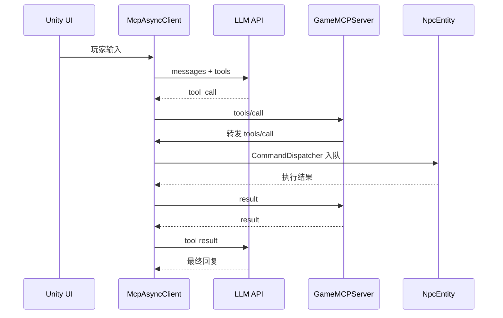
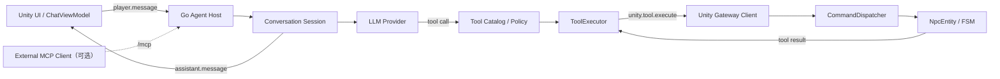

# Unity 与 Go 大模型能力边界重构计划

> 状态：核心边界重构完成 v0.6（M0 至 M4 与迁移收尾已完成；M5 持久化、M6 标准 MCP 均作为可选新功能冻结）
> 更新日期：2026-07-19  
> 适用仓库：GameWithLLM  
> 关联文档：[GameMCPServer 改造与目标架构建议](./GameMCPServer改造与目标架构建议.md)

## 0. 执行状态

### 0.1 第一轮结果（2026-07-19）

第一轮聚焦 Go Server 的测试保护和 WebSocket 基础设施，不迁移 LLM 会话，也不改变 `tools/list` / `tools/call` 的业务消息结构。

已完成：

- 建立 Go JSON-RPC Session、路由和真实 WebSocket 集成测试。
- 修复未知工具被转发后只能等待超时的问题，现在立即返回 `-32601`。
- 修复重复响应可能阻塞会话读循环的问题。
- 使用 `github.com/coder/websocket` 替换手写握手、帧、分片和 Ping/Pong 处理。
- 删除 `GameMCPServer/internal/unity/websocket.go`。
- 设置 1 MiB 单消息读取上限，并验证 Ping/Pong、分片消息和 16 KiB 消息。
- 新增正式入口 `/unity/ws`；`/ws` 和根路径暂时兼容并输出弃用日志。
- 使用显式 `http.Server`，增加 Header/Idle 超时、Signal 监听、HTTP Shutdown 和 WebSocket `Going Away` 关闭。
- 将 Go、Unity、示例环境变量和启动文档的默认地址切换到 `/unity/ws`。
- 将 `test_mcp.js` 的手写 WebSocket 客户端替换为 Node.js 标准 WebSocket。

验证结果：

```text
go test ./...        PASS
go test -race ./...  PASS
端到端协议测试       13 PASS / 0 FAIL
```

端到端测试在 `18080` 端口执行，因为当前开发环境的 `8080` 已被其他进程占用；未终止或修改该进程。

本轮基线：

| 项目 | 值 |
|---|---|
| 开始 Commit | `c639f021936caf908c69df283c1ec63359c7b94c` |
| Go | `go1.26.4 darwin/arm64` |
| Unity | `6000.3.19f1` |

未纳入第一轮：

- Unity 协议 DTO 自动化测试。
- 内部执行协议 v1 和 Unity Registry。
- Unity 客户端职责拆分。
- LLM 调用与历史迁移到 Go。

## 0.2 第二轮结果（2026-07-19）

第二轮完成 M2 内部执行协议 v1 的代码实现，并保留旧 `tools/list` / `tools/call` 兼容入口。

已完成：

- 新增强类型 `unity.register`、`unity.npc.changed`、`unity.tools.changed`、`unity.tool.execute` 和 `unity.tool.cancel` DTO。
- `arguments` 在 v1 通道中使用 JSON 对象，不再二次编码为字符串。
- 新增线程安全 `UnityRegistry`，维护实例、NPC、Session 和运行时工具能力映射。
- 新增统一 `ToolExecutor`，在 Go 侧预检查 NPC 在线状态和工具能力。
- 业务失败统一返回 `{ok:false,errorCode,message}`，协议失败继续使用 JSON-RPC error。
- 旧 `tools/call` 在 v1 实例注册后自动适配到 `unity.tool.execute`；旧客户端仍可继续使用环回链路。
- Unity 连接后主动发送完整实例/NPC/工具注册，并在运行时能力变化时发送增量通知。
- Unity 工具结果新增稳定错误码；Go 日志区分 `success`、`tool_error` 和协议/宿主错误。
- Go 超时或取消时发送 `unity.tool.cancel`；Unity 可跳过尚未进入 NPC 执行的排队命令。
- WebSocket 发送不再追加换行，并通过发送锁串行化。
- Unity 启动日志不再输出 LLM API Key。

自动验证：

```text
go test ./...        PASS
go test -race ./...  PASS
Unity C# build        PASS（0 warning / 0 error）
v1 WebSocket 集成测试 PASS
```

人工验收结果：

- Unity `SampleScene` 注册日志包含 `event=unity_registered` 和 `protocol_version=1`。
- 连续三次 `game_npc_move` 均记录 `outcome="success" protocol=v1`。
- NPC 已实际到达目标位置，M2 阶段门通过。

后续范围：

- M3 的网络职责拆分进入第三轮。
- M4 的 LLM API Key、对话 Session 和 tool loop 迁移到 Go。
- 标准 MCP 外部接口。

## 0.3 第三轮结果（2026-07-19）

第三轮完成 M3 Unity 网络职责拆分的代码实现，保留 `McpAsyncClient` 作为临时 LLM 会话编排入口。

已完成：

- 新增独立 `UnityGatewayClient`，集中负责 WebSocket 连接、注册、协议路由、pending、串行发送和关闭清理。
- 新增 `ReconnectPolicy`，连接失败按 1、2、4、8、15 秒指数退避，连接恢复后重新注册实例、NPC 和工具能力。
- 接收端循环读取到 `EndOfMessage=true` 后才解析，支持大于 8192 字节的分片文本消息。
- 单条消息限制与 Go 对齐为 1 MiB。
- pending 改为 `ConcurrentDictionary`；超时、取消、断线和销毁均返回明确异常并清理。
- 所有 WebSocket 发送继续由 `SemaphoreSlim` 串行化。
- Gateway 内网络 await 使用 `ConfigureAwait(false)`，避免网络延续占用 Unity 主线程。
- `CommandDispatcher` 的 NPC 注册表增加锁，网络线程可安全读取注册快照。
- 断线或超时的工具调用会转换为 `isError=true` 的工具结果，对话循环不会无提示卡死。
- `McpAsyncClient` 已移除 WebSocket、注册、协议解析和 pending 管理代码，只保留 LLM/对话编排及 Gateway 调用。

自动验证：

```text
Unity C# build        PASS（0 warning / 0 error）
```

人工验收结果：

- Unity 首次注册和 NPC 移动正常。
- 停止 Go Server 后 Unity 按指数退避重连。
- Go Server 重新启动后 Unity 自动注册成功。
- 重连后的 NPC 移动仍可到达目标，M3 阶段门通过。

后续范围：

- M4 的 LLM API Key、对话 Session 和 tool loop 迁移到 Go。
- 标准 MCP 外部接口。

## 0.4 第四轮结果（2026-07-19）

第四轮完成 M4 Go Agent Host 的代码迁移；Unity 不再直接访问 LLM。

已完成：

- Go 新增 OpenAI-compatible `LLMClient`，支持完整 `/chat/completions` 地址或以 `/v1` 结尾的基础地址。
- Go 新增 `ConversationService`、内存 `SessionStore`、消息模型和运行时工具适配器。
- Session 包含玩家、NPC、Unity 实例、System Prompt、模型、历史、当前 tool call 和时间信息。
- 新增 `conversation.start`、`player.message`、`conversation.end` 和 `assistant.status` 内部方法。
- Go 完成 LLM tool-call 循环：能力过滤、参数校验、注入 NPC、调用 `ToolExecutor`、配对写入 tool result、再次请求模型。
- 最大工具轮数由 `LLM_MAX_TOOL_ROUNDS` 控制，避免模型无限调用工具。
- LLM、会话和工具执行日志只记录 ID、长度、耗时与结果，不记录 API Key 或玩家消息正文。
- 断线和结束会话会取消正在进行的 LLM 请求；Session 取消使用独立锁，不等待 HTTP 超时。
- Unity `McpAsyncClient` 删除 `HttpClient`、API Key、模型配置、本地 LLM 请求和 tool loop，只保留 Gateway/UI 适配。
- 删除无场景引用、无运行时调用的 Unity `HistoryManager` 本地 LLM 历史实现；展示缓存继续由 `ChatViewModel` 管理。
- Unity 构建物不再引用 `OPENAI_API_KEY`、`LLM_API_URL`、`LLM_MODEL` 或 `HttpClient`。
- 模型可见工具由 Go 根据 Unity 注册能力生成；Unity 删除 `GetToolsForLlm()`。
- 当前 Session 策略明确为内存且连接级：Unity 断线或 Go 重启后自动创建新 Session，不恢复旧历史。

新增 Go 配置：

- `LLM_API_KEY`，并兼容旧 `OPENAI_API_KEY`。
- `LLM_REQUEST_TIMEOUT_SECONDS`，默认 60。
- `LLM_MAX_TOOL_ROUNDS`，默认 4。
- `PLAYER_ID` 由 Unity 读取，默认 `local-player-1`。

自动验证：

```text
go test ./...                    PASS
go test -race ./...              PASS
Go Agent tool-loop WebSocket E2E PASS
Unity C# build                    PASS（0 warning / 0 error）
Unity LLM/HttpClient 引用扫描     PASS（0 references）
```

人工验收结果：

- 用户已确认普通对话、工具调用、NPC 行动和最终回复均正常。
- Go 控制台已确认完整 Agent Host 与 `unity.tool.execute` 链路。
- M4 阶段门通过。

未纳入本轮：

- 持久化历史、TTL 和长期记忆属于可选新功能，本轮不实现。
- 单一工具契约来源已经在迁移收尾中完成：Go 不再维护硬编码默认 Schema。
- 标准 MCP 外部接口。

## 0.5 迁移收尾结果（2026-07-19）

用户完成 M4 真实场景验收后，继续删除 M1 至 M4 遗留的过渡层，不引入持久化、TTL、长期记忆或标准 MCP 等新能力。

已完成：

- 删除 Go 连接启动时主动发送的旧 `tools/list` 同步请求。
- 删除 Go 对旧 `tools/list` / `tools/call` 的处理、适配和 `protocol=legacy` 日志。
- 删除 `internal/unity/tools.go` 及其中硬编码的 `game_npc_move` 默认 Schema；模型可见工具只来自 `UnityRegistry` 的运行时注册快照。
- Unity 删除旧工具协议解析和双结果格式，统一为 `UnityToolCommand` 与 `{ok,errorCode,message}`。
- Unity 本地执行辅助类统一改名为 `GameToolWrapper` / `ToolArgsBase`，`ToolsRegistry` 删除无调用的工具实例接口，只保留运行时 Schema 注册。
- `McpAsyncClient` 重命名为 `AgentHostClient`，只承担 Unity 交互、会话门面和 UI 回调职责。
- 删除 `/ws` 与根路径 WebSocket Upgrade；唯一 Unity WebSocket 入口为 `/unity/ws`。
- 重写单元、集成和 Node 冒烟测试，只覆盖当前 Agent Host + 内部协议 v1 链路，并明确断言旧方法返回 `-32601`。

验证结果：

```text
go test ./...                    PASS
go vet ./...                     PASS
go test -race ./...              PASS
Unity C# build                    PASS（0 warning / 0 error）
当前协议端到端冒烟测试            7 PASS / 0 FAIL
```

最终范围结论：M0 至 M4 的职责边界重构和兼容层清理完成。M5 中的持久化历史、TTL、长期记忆，以及 M6 标准 MCP 接口均是新增能力，等待单独立项。

---
## 1. 计划目标

本计划用于把当前的 Unity → Go → Unity 工具调用环回链路，逐步重构为职责明确、可测试、可扩展的 Agent Host 架构。

最终能力边界：

- Go 负责理解、记忆、决策、工具策略、模型调用和请求追踪。
- Unity 负责玩家交互、游戏世界状态、NPC 状态机和实际行为执行。
- Go 与 Unity 使用独立的内部执行协议通信。
- 标准 MCP 作为可选的外部接口，由官方 SDK 实现，不与 Unity 内部协议混用。

本次重构必须保持以下现有能力：

- 玩家可以与指定 NPC 开始会话。
- 模型可以发起 `game_npc_move`。
- 工具命令通过 NPC ID 路由到正确实体。
- Unity API 只在主线程执行。
- 工具结果能够回到模型上下文并产生最终回复。

---

## 2. 当前基线

### 2.1 当前链路



### 2.2 当前主要问题

- Go 仅做环回转发，没有形成安全或会话边界。
- Unity 保存 LLM API Key 并直接调用模型。
- `McpAsyncClient.cs` 同时承担网络、会话、模型和工具调度职责。
- Go 手写 WebSocket 握手与帧协议。
- Go 与 Unity 重复维护工具 Schema。
- 内部协议使用 MCP 方法名，但没有实现完整 MCP 生命周期。
- Unity WebSocket 接收没有正确拼接分片消息。
- pending 请求缺少统一的线程安全、取消和断线清理。
- Go 包当前没有单元测试。

### 2.3 重构前基线确认

开始代码改造前必须记录：

- 当前 `main` Commit SHA。
- Unity Editor 版本。
- Go 版本。
- 当前可运行场景和启动步骤。
- 一次完整对话和工具调用日志。
- 当前 `.env` 所需配置项。

基线验收命令：

```bash
cd GameMCPServer
go test ./...
```

Unity 侧需要人工确认：

1. 打开 `SampleScene`。
2. 启动 Go 服务。
3. 进入 Play Mode。
4. 打开聊天窗口。
5. 发送一条能触发移动工具的消息。
6. 记录当前成功和失败行为。

---

## 3. 目标架构



### 3.1 Go 的目标职责

- LLM Provider 配置和 API Key。
- NPC 对话 Session。
- System Prompt 和消息历史。
- 模型请求、重试和错误处理。
- Tool-call 循环。
- 模型可见工具列表。
- JSON Schema 和权限校验。
- NPC Session 绑定。
- 请求 ID、超时、取消和审计。
- Unity 实例、NPC 和工具能力注册。
- 可选标准 MCP 接口。

### 3.2 Unity 的目标职责

- 玩家输入和聊天窗口展示。
- 当前 Unity 实例注册。
- NPC 上下线与运行时能力注册。
- 接收工具执行命令。
- 网络线程到主线程的安全投递。
- NPC FSM 和实时状态校验。
- NavMesh、动画和 GameObject 操作。
- 返回工具进度和最终结果。

### 3.3 双层校验边界

Go 校验：

- 工具是否存在。
- 参数是否符合 Schema。
- Session 是否绑定 NPC。
- NPC 是否已注册并在线。
- 当前调用方是否有权限。
- 请求是否超时或被取消。
- 是否超过并发限制。

Unity 校验：

- NPC GameObject 是否仍存在。
- NPC 当前 FSM 是否允许执行。
- 地标、路径和游戏资源是否存在。
- NavMesh 是否可达。
- 动作是否执行成功。
- 游戏状态是否发生变化。

Unity 是游戏世界状态的最终权威。

---

## 4. 总体实施策略

重构采用渐进迁移，不在一个提交中同时替换网络、协议、LLM 和 UI。

原则：

1. 先建立测试基线。
2. 先替换底层 WebSocket，不改变业务行为。
3. 再规范 Go ↔ Unity 内部协议。
4. 再拆分 Unity 客户端职责。
5. 最后把 LLM 会话迁到 Go。
6. 标准 MCP 接口作为独立的可选阶段。

每个阶段必须：

- 可以独立构建和验证。
- 有明确回滚点。
- 不依赖未完成的下一阶段。
- 使用独立提交或 PR。
- 完成验收后再进入下一阶段。

---

## 5. 里程碑总览

| 里程碑 | 目标 | 主要产物 | 依赖 |
|---|---|---|---|
| M0 | 建立基线与测试保护 | 协议测试、并发测试、运行记录 | 无 |
| M1 | 替换手写 WebSocket | `coder/websocket`、优雅关闭 | M0 |
| M2 | 建立内部协议 v1 | 注册、执行、结果、错误模型 | M1 |
| M3 | 拆分 Unity 网络职责 | `UnityGatewayClient`、可靠收发 | M2 |
| M4 | 把 Agent Host 迁到 Go | LLM Client、Session、tool loop | M3 |
| M5（冻结） | 可选持久化能力 | 持久化历史、TTL、长期记忆 | M4 |
| M6 | 可选标准 MCP 接口 | 官方 Go MCP SDK、`/mcp` | M5 |

---

## 6. M0：基线与测试保护

### 6.1 目标

在改变协议前，建立能够捕获回归的自动化测试。

### 6.2 任务

#### M0-GO-01：为 JSON-RPC Session 增加单元测试

覆盖：

- `tools/list` 正常响应。
- `tools/call` 正常转发。
- 重复请求 ID。
- 缺少请求 ID。
- 缺少 `npcId`。
- 缺少工具名。
- 缺少参数。
- Unity 返回成功。
- Unity 返回错误。
- Unity 执行超时。
- 连接断开。

建议新增：

```text
GameMCPServer/internal/unity/session_test.go
GameMCPServer/internal/unity/protocol_test.go
```

#### M0-GO-02：替换手写 JavaScript WebSocket 测试客户端

当前 `test_mcp.js` 自行实现了 WebSocket 帧协议。M1 完成后应改为使用成熟客户端；M0 阶段先保留它作为兼容性基线，但不继续扩展其底层帧代码。

#### M0-GO-03：增加 Race Test

```bash
go test -race ./...
```

重点验证：

- `pending` map。
- 并发工具调用。
- 连接断开和超时同时发生。
- 多个 goroutine 写同一连接。

#### M0-UNITY-01：建立协议 DTO 测试

覆盖：

- 请求反序列化。
- 成功结果序列化。
- 错误结果序列化。
- 大于 8192 字节消息。
- 无效参数。

### 6.3 验收标准

- Go 的核心协议路径有自动化测试。
- `go test ./...` 通过。
- `go test -race ./...` 通过。
- 当前端到端行为被记录并可重复。

### 6.4 回滚点

该阶段只增加测试，不修改生产行为，可直接回滚测试提交。

---

## 7. M1：替换手写 WebSocket

### 7.1 目标

在不改变业务消息结构的情况下，用成熟库替换 WebSocket 握手和帧处理。

### 7.2 技术选型

使用：

```text
github.com/coder/websocket
```

继续使用：

```text
net/http
encoding/json
```

### 7.3 Go 任务

#### M1-GO-01：引入 WebSocket 库

修改：

```text
GameMCPServer/go.mod
GameMCPServer/go.sum
```

#### M1-GO-02：删除手写帧协议

删除：

```text
GameMCPServer/internal/unity/websocket.go
```

由库负责：

- Upgrade。
- 帧和分片。
- Ping/Pong。
- Close handshake。
- Context 取消。
- JSON 消息边界。

#### M1-GO-03：重写连接接入

调整：

```text
GameMCPServer/internal/unity/server.go
GameMCPServer/internal/unity/session.go
```

约束：

- 每个 Session 有独立 Context。
- 消息大小上限默认 1 MiB。
- 所有写操作串行化。
- 正常关闭使用标准 Close Code。
- 连接断开立即取消全部 pending 请求。

#### M1-GO-04：规范路由

将 WebSocket 入口统一为：

```text
/unity/ws
```

兼容期内保留 `/ws` 和根路径 WebSocket Upgrade，但输出弃用日志；待 Unity 默认配置完成迁移并经过一轮发布验证后删除根路径兼容。

#### M1-GO-05：HTTP Server 生命周期

把 `http.ListenAndServe` 改为显式 `http.Server`：

- `ReadHeaderTimeout`。
- `IdleTimeout`。
- Signal 监听。
- `Shutdown(ctx)`。

### 7.4 Unity 任务

该阶段不改变 Unity 消息格式，只调整默认地址为 `/unity/ws`；兼容期也可以继续连接 `/ws`。

### 7.5 验收标准

- 现有工具调用闭环保持不变。
- 手写 WebSocket 代码完全删除。
- 连接关闭后没有遗留 goroutine。
- 大于单帧缓冲区的消息可以被 Go 正确读取。
- `/health` 不受影响。

### 7.6 回滚点

保留 M0 测试基线。如库替换失败，整体回滚 M1 提交，不影响消息协议。

---

## 8. M2：内部执行协议 v1

### 8.1 目标

把 Go ↔ Unity 通道明确为版本化的私有执行协议，取消“半标准 MCP”语义。

### 8.2 协议方法

Unity → Go：

- `unity.register`
- `unity.npc.changed`
- `unity.tools.changed`
- 工具调用响应
- `unity.tool.progress`（可选）

Go → Unity：

- `unity.tool.execute`
- `unity.tool.cancel`
- Ping/状态请求（按需）

### 8.3 注册消息

```json
{
  "jsonrpc": "2.0",
  "id": "register-1",
  "method": "unity.register",
  "params": {
    "protocolVersion": 1,
    "instanceId": "local-game-1",
    "tools": [],
    "npcs": ["Ryan_001"]
  }
}
```

### 8.4 工具执行消息

```json
{
  "jsonrpc": "2.0",
  "id": "call-123",
  "method": "unity.tool.execute",
  "params": {
    "npcId": "Ryan_001",
    "tool": "game_npc_move",
    "arguments": {
      "targetLandmark": "warehouse"
    }
  }
}
```

### 8.5 结果模型

成功：

```json
{
  "jsonrpc": "2.0",
  "id": "call-123",
  "result": {
    "ok": true,
    "message": "NPC开始移动"
  }
}
```

业务失败：

```json
{
  "jsonrpc": "2.0",
  "id": "call-123",
  "result": {
    "ok": false,
    "errorCode": "LANDMARK_NOT_FOUND",
    "message": "目标地标不存在"
  }
}
```

只有协议解析或参数格式错误使用 JSON-RPC `error`。

### 8.6 Go 任务

#### M2-GO-01：建立强类型协议 DTO

修改：

```text
GameMCPServer/internal/unity/protocol.go
```

要求：

- `arguments` 是 JSON 对象，不再是二次编码字符串。
- 明确 `protocolVersion`。
- 明确业务错误码。
- 不在内部协议使用标准 MCP ToolResult 类型。

#### M2-GO-02：实现 Unity Registry

新增：

```text
GameMCPServer/internal/unity/registry.go
```

负责：

- `instanceID -> Session`。
- `npcID -> instanceID`。
- 重复注册策略。
- 断线清理。
- NPC 上下线。
- 工具目录更新。

#### M2-GO-03：实现 ToolExecutor

新增：

```text
GameMCPServer/internal/unity/tool_executor.go
```

接口：

```go
type ToolExecutor interface {
    Execute(
        ctx context.Context,
        instanceID string,
        npcID string,
        tool string,
        arguments json.RawMessage,
    ) (*ToolResult, error)
}
```

#### M2-GO-04：移除硬编码工具表

逐步删除：

```text
GameMCPServer/internal/unity/tools.go
```

Go 的工具目录来自 Unity 注册消息。

### 8.7 Unity 任务

- 连接成功后发送 `unity.register`。
- NPC 注册和注销时同步变化。
- 工具发生变化时同步目录。
- 接收 `unity.tool.execute`。
- 返回统一结果模型。

### 8.8 兼容策略

协议 v1 迁移期间：

- Go 同时接受旧 `tools/call` 和新 `unity.tool.execute`。
- Unity 优先使用 v1。
- 日志标记旧协议调用。
- v1 稳定后删除旧协议。

### 8.9 验收标准

- Unity 注册成功前，Go 不发送工具命令。
- 未注册 NPC 在 Go 侧立即失败。
- 未注册工具在 Go 侧立即失败。
- `arguments` 不再出现 JSON 字符串二次编码。
- Unity 重连后注册状态可恢复。

---

## 9. M3：拆分 Unity 网络职责

### 9.1 目标

把网络连接从 LLM 会话逻辑中拆出，建立可靠的 Unity Gateway Client。

### 9.2 新增文件

```text
unity-NPC-agent-client/Assets/Scripts/Networking/UnityGatewayClient.cs
unity-NPC-agent-client/Assets/Scripts/Networking/UnityGatewayProtocol.cs
unity-NPC-agent-client/Assets/Scripts/Networking/ReconnectPolicy.cs
```

### 9.3 UnityGatewayClient 职责

- 建立和关闭 WebSocket。
- 发送实例注册信息。
- 接收完整消息。
- 协议反序列化。
- pending 请求管理。
- 串行发送。
- 超时和取消。
- 断线清理。
- 指数退避重连。
- 重连后重新注册。

### 9.4 必须修复的网络问题

#### M3-UNITY-01：完整读取 WebSocket 消息

循环调用 `ReceiveAsync`，直到 `EndOfMessage=true`，再解析 JSON。

#### M3-UNITY-02：发送串行化

使用 `SemaphoreSlim` 或单发送队列，保证同一 `ClientWebSocket` 不发生并发 Send。

#### M3-UNITY-03：线程安全 pending

使用 `ConcurrentDictionary` 或统一网络线程管理 pending。

#### M3-UNITY-04：统一取消

连接关闭时：

- 取消接收循环。
- 使所有 pending 请求失败。
- 释放 WebSocket。
- 进入重连策略。

#### M3-UNITY-05：移除换行帧

WebSocket 消息不再追加 `\n`。

### 9.5 ChatViewModel 调整

该阶段 `ChatViewModel` 仍可调用旧的 LLM 会话入口，但不再感知 WebSocket 细节。

### 9.6 McpAsyncClient 过渡

将 `McpAsyncClient` 暂时缩减为：

- 旧 LLM 会话编排。
- 调用 `UnityGatewayClient`。

M4 完成后再删除其中的 LLM 能力。

### 9.7 验收标准

- 大于 8192 字节的消息可正确读取。
- 多个并发发送不会抛出 WebSocket 状态异常。
- Go 重启后 Unity 可以自动重连。
- 断线时所有等待请求有明确错误。
- Unity 主线程不执行网络 I/O。

---

## 10. M4：将 Agent Host 迁移到 Go

### 10.1 目标

把 LLM API Key、对话历史、模型请求和 tool-call 循环从 Unity 迁移到 Go。

### 10.2 Go 新增模块

```text
GameMCPServer/internal/agent/conversation.go
GameMCPServer/internal/agent/session.go
GameMCPServer/internal/agent/session_store.go
GameMCPServer/internal/agent/llm_client.go
GameMCPServer/internal/agent/messages.go
GameMCPServer/internal/tools/catalog.go
GameMCPServer/internal/tools/validator.go
GameMCPServer/internal/tools/policy.go
```

### 10.3 核心接口

#### LLM Provider

```go
type LLMClient interface {
    Complete(ctx context.Context, req CompletionRequest) (*CompletionResult, error)
}
```

业务层不直接依赖某个厂商的 HTTP DTO。

#### Conversation Service

```go
type ConversationService interface {
    StartSession(ctx context.Context, playerID, npcID string) (*Session, error)
    SubmitMessage(ctx context.Context, sessionID, text string) (*AssistantReply, error)
    EndSession(ctx context.Context, sessionID string) error
}
```

### 10.4 Session 数据

每个 Session 至少包含：

- `sessionID`。
- `playerID`。
- `npcID`。
- `unityInstanceID`。
- System Prompt。
- 消息历史。
- 当前模型配置。
- 当前进行中的 tool call。
- 创建和最后活跃时间。
- Session 级取消函数。

### 10.5 新对话链路

Unity → Go：

```json
{
  "type": "player.message",
  "sessionId": "session-123",
  "text": "去仓库看看"
}
```

Go → Unity：

```json
{
  "type": "assistant.message",
  "sessionId": "session-123",
  "npcId": "Ryan_001",
  "text": "我去仓库入口确认一下。"
}
```

### 10.6 Go Tool-call 循环

1. 接收玩家消息。
2. 加载 Session 历史。
3. 根据 NPC 和权限生成模型可见工具。
4. 调用 LLM。
5. 如果返回 tool call：
   - 校验工具与参数。
   - 从 Session 注入 `npcId`。
   - 调用 `ToolExecutor`。
   - 将结果加入消息历史。
   - 再次调用 LLM。
6. 返回最终文本。
7. 保存完整原子历史。

### 10.7 Unity 删除能力

从 `McpAsyncClient.cs` 迁移或删除：

- `llmApiUrl`。
- `llmModel`。
- `llmApiKey`。
- `HttpClient`。
- `SendLlmRequestAsync`。
- `SessionTaskAsync` 中的模型循环。
- Unity 侧 LLM messages 权威历史。
- `ToolsRegistry.GetToolsForLlm()`。

### 10.8 Unity 保留能力

- `ChatViewModel`。
- 玩家消息即时展示。
- 发送 `player.message`。
- 接收 `assistant.message`。
- 展示思考、工具执行和错误状态。
- 可选的本地 UI 缓存。

### 10.9 配置迁移

Go 新增：

- `LLM_API_URL`。
- `LLM_API_KEY` 或继续兼容 `OPENAI_API_KEY`。
- `LLM_MODEL`。
- `LLM_REQUEST_TIMEOUT_SECONDS`。
- `LLM_MAX_TOOL_ROUNDS`。

Unity 删除对 API Key 的读取。

### 10.10 功能开关

迁移期建议支持：

```text
AGENT_HOST_MODE=unity|go
```

- `unity`：保留旧会话链路，用于回滚。
- `go`：使用新 Agent Host。

稳定后删除 `unity` 模式。

### 10.11 验收标准

- Unity 构建物中不包含 LLM API Key。
- Unity 不再直接请求 LLM 服务。
- Go 能完成无工具和有工具两种对话。
- 工具调用最多执行配置的轮数，防止无限循环。
- 每个 NPC Session 相互隔离。
- Go 重启后的 Session 行为符合明确策略。
- 工具请求与结果在历史中保持原子配对。

---

## 11. M5：历史、工具契约与状态收敛

> 执行状态：Schema 所有权、Go 权威 Session、Unity 状态快照和重连更新等重构项已完成。当前 `MemorySessionStore` 已满足既定接口；磁盘/数据库持久化、TTL 和长期记忆属于新增产品能力，已冻结，不纳入本次收尾。

### 11.1 目标

确定单一数据来源，消除 Go 与 Unity 的重复状态。

### 11.2 工具 Schema 所有权

采用两阶段所有权：

1. Unity 是“实际可执行工具”的来源。
2. Go 是“模型可见工具”的来源。

Unity 注册运行时能力；Go 根据 Session、NPC、权限和游戏模式筛选后交给 LLM。

### 11.3 对话历史所有权

Go 是权威来源，Unity 只保存展示缓存。

定义存储接口：

```go
type SessionStore interface {
    Load(ctx context.Context, sessionID string) (*Session, error)
    Save(ctx context.Context, session *Session) error
    Delete(ctx context.Context, sessionID string) error
}
```

第一版可以使用内存实现，后续再决定文件或数据库。

### 11.4 NPC 状态所有权

- Unity 持有实时状态。
- Go 只持有用于路由和策略的状态快照。
- Go 不直接推断 Unity GameObject 是否存在。
- 执行前后的最终判断由 Unity 返回。

### 11.5 验收标准

- 工具 Schema 不再手动复制两份。
- Go 可根据 NPC 筛选模型工具。
- Unity 重连后 Go 的能力目录正确更新。
- Unity 清空 UI 不会删除 Go 权威历史。

---

## 12. M6：可选标准 MCP 接口

### 12.1 启动条件

只有明确需要以下能力时实施：

- Codex、Claude Desktop 等标准 MCP Client 控制游戏。
- 外部 Agent 调用游戏工具。
- 将游戏能力暴露给调试或自动化平台。

### 12.2 技术选型

使用：

```text
github.com/modelcontextprotocol/go-sdk/mcp
```

传输：

```text
Streamable HTTP /mcp
```

### 12.3 约束

- MCP Handler 只能调用统一 `ToolExecutor`。
- MCP 层不直接访问 WebSocket Session 内部字段。
- Unity 私有 `instanceId` 和内部错误不得直接泄漏。
- 必须定义外部请求如何绑定玩家和 NPC。
- 远程访问必须增加认证、授权、限流和审计。

### 12.4 验收标准

- 标准客户端可完成 initialize、tools/list 和 tools/call。
- 外部 MCP 和游戏内部对话复用相同工具执行路径。
- 未授权客户端不能调用工具。
- Unity 断线时 MCP 调用得到明确错误。

---

## 13. 文件级改造清单

### 13.1 Go

| 当前文件 | 动作 | 目标 |
|---|---|---|
| `cmd/server/main.go` | 修改 | HTTP Server 超时和优雅关闭 |
| `internal/handler/router.go` | 修改 | 增加 `/unity/ws`，逐步弃用旧入口 |
| `internal/unity/websocket.go` | 删除 | 使用 `coder/websocket` |
| `internal/unity/server.go` | 重写 | Gateway 连接接入 |
| `internal/unity/session.go` | 拆分 | Session、pending、读写循环 |
| `internal/unity/protocol.go` | 重写 | 内部协议 v1 DTO |
| `internal/unity/tools.go` | 删除/迁移 | 工具来自 Unity 注册 |
| `internal/unity/registry.go` | 新增 | Unity/NPC 注册表 |
| `internal/unity/pending.go` | 新增 | 请求关联和取消 |
| `internal/unity/tool_executor.go` | 新增 | 统一工具执行接口 |
| `internal/agent/*` | 新增 | LLM 和会话编排 |
| `internal/tools/*` | 新增 | 工具目录、Schema、Policy |
| `internal/mcp/server.go` | 可选新增 | 标准 MCP 接口 |

### 13.2 Unity

| 当前文件 | 动作 | 目标 |
|---|---|---|
| `McpAsyncClient.cs` | 拆分并最终删除/重命名 | 移除混合职责 |
| `Networking/UnityGatewayClient.cs` | 新增 | 可靠 WebSocket 客户端 |
| `Networking/UnityGatewayProtocol.cs` | 新增 | 强类型内部协议 |
| `Networking/ReconnectPolicy.cs` | 新增 | 自动重连 |
| `ToolsRegistry.cs` | 修改 | 注册实际执行能力，不再直接服务 LLM |
| `CommandDispatcher.cs` | 小幅修改 | 接收新协议 DTO |
| `McpToolWrapper.cs` | 保留并增强 | Unity 最终状态校验 |
| `NpcEntity.cs` | 修改 | 标准工具结果和错误码 |
| `ChatViewModel.cs` | 修改 | 发送玩家消息、接收 Go 回复 |
| `FileHistoryProvider.cs` | 降级/迁移 | UI 缓存或移除权威职责 |

---

## 14. 测试矩阵

| 场景 | Go 单测 | Go 集成 | Unity 测试 | 人工 E2E |
|---|---:|---:|---:|---:|
| Unity 注册 | ✓ | ✓ | ✓ | ✓ |
| NPC 上下线 | ✓ | ✓ | ✓ | ✓ |
| 工具发现 | ✓ | ✓ | ✓ | ✓ |
| 正常移动 | ✓ | ✓ | ✓ | ✓ |
| 未知工具 | ✓ | ✓ | ✓ | ✓ |
| 未知 NPC | ✓ | ✓ | ✓ | ✓ |
| 无效参数 | ✓ | ✓ | ✓ | ✓ |
| 地标不存在 | ✓ | ✓ | ✓ | ✓ |
| 工具超时 | ✓ | ✓ | ✓ | ✓ |
| 连接断开 | ✓ | ✓ | ✓ | ✓ |
| 自动重连 |  | ✓ | ✓ | ✓ |
| 并发工具调用 | ✓ | ✓ | ✓ | ✓ |
| 大消息/分片 |  | ✓ | ✓ | ✓ |
| 无工具对话 | ✓ | ✓ | ✓ | ✓ |
| 多轮工具对话 | ✓ | ✓ | ✓ | ✓ |
| 多 NPC Session 隔离 | ✓ | ✓ | ✓ | ✓ |
| 服务优雅关闭 |  | ✓ |  | ✓ |

---

## 15. 可观测性要求

每次对话和工具调用至少记录：

- `sessionId`。
- `playerId`（如果存在）。
- `npcId`。
- `unityInstanceId`。
- `requestId` / `toolCallId`。
- 工具名称。
- 执行时长。
- 成功、业务失败或协议失败。
- LLM 请求耗时。
- Tool-call 轮数。

日志不得记录：

- LLM API Key。
- 用户 Secret。
- 未经处理的敏感配置。

建议指标：

- Unity 在线连接数。
- 在线 NPC 数。
- 活跃 Session 数。
- LLM 请求成功率和延迟。
- 工具调用成功率和延迟。
- 工具超时次数。
- Unity 重连次数。
- pending 请求数量。

---

## 16. 风险与缓解措施

### 风险 1：一次性迁移范围过大

缓解：严格按 M0 → M6 分阶段，每阶段保留可运行状态。

### 风险 2：Unity 与 Go 协议不同步

缓解：协议带版本；迁移期双协议兼容；增加双方 DTO 测试和集成测试。

### 风险 3：LLM 迁移后对话行为变化

缓解：保存当前请求样本；Go 使用相同 model、prompt、tools 和消息顺序做对比测试。

### 风险 4：工具调用无限循环

缓解：配置 `LLM_MAX_TOOL_ROUNDS`，超限后返回可诊断错误。

### 风险 5：NPC 状态与 Go 缓存不一致

缓解：Unity 保持最终权威；Go 缓存只用于预检查；Unity 返回明确业务错误。

### 风险 6：断线导致永久等待

缓解：所有 pending 请求绑定连接 Context；断线统一失败；每次调用有 deadline。

### 风险 7：历史迁移丢失

缓解：先定义 `SessionStore`；迁移期保留 Unity 历史只读备份；完成一致性检查后再删除旧写入。

### 风险 8：本机其他进程调用游戏工具

缓解：只监听 `127.0.0.1`；增加随机 Session Token；限制消息大小和速率。

---

## 17. 提交与评审策略

建议提交边界：

1. `test: add gateway protocol baseline tests`
2. `refactor: replace raw websocket implementation`
3. `feat: add unity gateway protocol v1`
4. `refactor: split unity gateway client from mcp async client`
5. `feat: add go conversation session and llm client`
6. `refactor: route chat messages through go agent host`
7. `refactor: unify runtime tool catalog`
8. `feat: add standard mcp endpoint`（可选）

每个评审必须提供：

- 改动前后时序。
- 新增或更新的测试。
- 手工验证步骤。
- 配置变化。
- 回滚方法。
- 已知限制。

禁止在同一个提交中同时进行：

- WebSocket 库替换与 LLM 迁移。
- 协议字段重命名与 UI 大改。
- 历史存储迁移与工具 Schema 重构。

---

## 18. 待确认决策

以下决策在对应阶段开始前确认，不阻塞 M0 和 M1：

| 决策 | 推荐默认值 | 最晚确认阶段 |
|---|---|---|
| LLM Provider | 先兼容当前 OpenAI 请求格式 | M4 |
| 对话历史存储 | 第一版内存，接口预留持久化 | M4 |
| 玩家身份模型 | 单机默认 `local-player` | M4 |
| Unity 实例 ID | 配置值 + 启动实例 UUID | M2 |
| NPC 并发策略 | 同一 NPC 同时一个行为工具 | M4 |
| 工具进度通知 | 第一版只返回最终结果 | M2 |
| 外部 MCP | 默认不实现 | M6 |
| 离线降级 | 第一版返回不可用，不在 Unity 调 LLM | M4 |

---

## 19. Definition of Done

整个重构完成需同时满足：

- Go 不再手写 WebSocket 帧协议。
- Go ↔ Unity 使用版本化内部协议。
- Unity 可以注册实例、NPC 和工具能力。
- 工具参数不再二次编码为 JSON 字符串。
- Go 管理 LLM API Key、模型调用和对话历史。
- Unity 不直接访问 LLM API。
- Unity 只在主线程执行游戏对象操作。
- 工具 Schema 有明确单一来源。
- 所有工具调用有超时、取消和断线清理。
- Go 单元测试和 Race Test 通过。
- Unity 协议和主线程路由测试通过。
- 完整对话、工具调用和最终回复 E2E 通过。
- 文档、启动说明和配置示例同步更新。

---

## 20. 第一轮执行清单

第一轮只启动 M0 和 M1，不同时迁移 LLM。

- [ ] 建立重构分支。
- [x] 记录当前自动化端到端运行日志。
- [x] 为 `jsonRPCSession` 增加测试。
- [x] 增加并发和超时测试。
- [x] 引入 `coder/websocket`。
- [x] 删除 `internal/unity/websocket.go`。
- [x] 保持旧消息格式通过全部测试。
- [x] 增加 `/unity/ws` 并兼容 `/ws`。
- [x] 增加 Go HTTP Server 优雅关闭。
- [x] 运行 `go test ./...`。
- [x] 运行 `go test -race ./...`。
- [ ] 使用 Unity 完成一次人工工具调用验证。
- [x] 更新启动说明中的 WebSocket 地址。

M0、M1 验收完成后，再评审 M2 内部协议 v1 的字段和兼容窗口。
